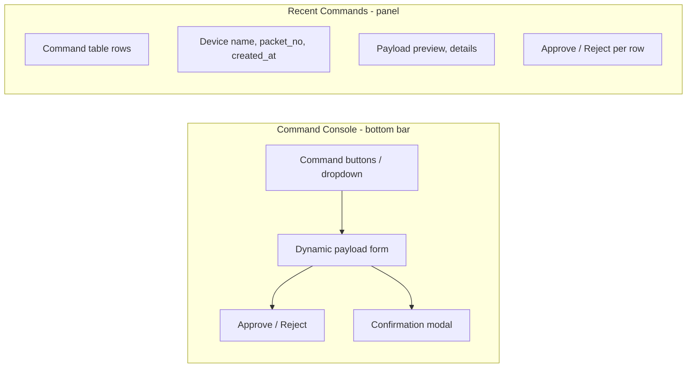

# Command Console Improvement Plan

## Impact Analysis: 10 Gaps on the App

| Gap                                  | Affects                              | Visual Impact                                                                      | User Impact                                                                                                              |
| ------------------------------------ | ------------------------------------ | ---------------------------------------------------------------------------------- | ------------------------------------------------------------------------------------------------------------------------ |
| **1. Policies-driven dropdown**      | Command Console                      | Command list may change (fewer/different commands if backend restricts)            | Same UI pattern; content could differ                                                                                    |
| **2. command_requested**             | RecentCommands                       | None                                                                               | Commands appear in table faster when WS fires before REST returns                                                        |
| **3. Dynamic payload form**          | **Command Console**                  | **Major** — Clicking "IP Set" etc. opens a form instead of instant send            | Enables commands that need inputs (IP_SET, ATTACK_MODE_SET, BAND_RANGE_SET, TURNTABLE_DIR, TURNTABLE_POINT, GATEWAY_SET) |
| **4. Commands table columns**        | RecentCommands                       | More columns: device name, packet_no, created_at, payload preview                  | Richer command history; better debugging                                                                                 |
| **5. PENDING_APPROVAL UI**           | **Command Console** + RecentCommands | **New** — Approve/Reject buttons appear when command needs approval                | User can approve/reject high-risk commands                                                                               |
| **6. RESTART confirmation**          | **Command Console**                  | **Modal** — "Are you sure?" before RESTART                                         | Prevents accidental restarts                                                                                             |
| **7. ACK/response display**          | RecentCommands                       | Richer status text, payload preview, details drawer                                | Clearer feedback                                                                                                         |
| **8. CommandPolicy datatype**        | Backend/types                        | None                                                                               | Type alignment only                                                                                                      |
| **9. TURNTABLE_POINT payload**       | **Command Console**                  | **Form** — Track may need azimuth/elevation inputs instead of auto lat/lon         | Depends on backend                                                                                                       |
| **10. JAM_START vs ATTACK_MODE_SET** | **Command Console**                  | **Form** — Engage may need mode/switch dropdown if backend expects ATTACK_MODE_SET | Depends on backend                                                                                                       |

---

## Command Console vs RecentCommands

**Command Console** = where you send commands (entity selected, bottom bar).  
**RecentCommands** = where you see command history and status.

---

## Command Console Improvement Scope

### Gaps that directly affect Command Console

| Gap                             | Priority | What changes                                                                                                                                                   |
| ------------------------------- | -------- | -------------------------------------------------------------------------------------------------------------------------------------------------------------- |
| **3. Dynamic payload form**     | High     | Click "IP Set" → form with ip, port, netmask, route, dns. Click "Attack Mode Set" → mode dropdown + switch. Click "Track" → azimuth/elevation or keep lat/lon. |
| **5. PENDING_APPROVAL UI**      | Medium   | When a sent command is PENDING_APPROVAL, show Approve / Reject in the console or inline in RecentCommands.                                                     |
| **6. RESTART confirmation**     | Low      | Modal before RESTART: "Are you sure? This will restart the device."                                                                                            |
| **1. Policies-driven dropdown** | Medium   | Optional: use GET /api/v1/policies to populate commands; fallback to hardcoded catalog.                                                                        |
| **9. TURNTABLE_POINT**          | Verify   | If backend expects `{h_enable, horizontal, v_enable, vertical}`, add form for Track.                                                                           |
| **10. JAM_START**               | Verify   | If backend expects ATTACK_MODE_SET with payload, add Engage form.                                                                                              |

---

## Recommended Command Console Plan

### Phase 1: Core UX (no payload forms yet)

1. **RESTART confirmation** — Add confirmation modal before sending RESTART.
2. **PENDING_APPROVAL UI** — When a command in the store is PENDING_APPROVAL, show Approve / Reject. Best place: RecentCommands row (per command) or a small banner in Command Console when the last sent command is pending.

### Phase 2: Dynamic payload forms

1. **Command payload schema** — Extend [lib/commands.ts](src/lib/commands.ts) with payload field definitions (e.g. `{ip: string, port: number, ...}`).
2. **CommandForm component** — Reusable form that renders inputs based on command type. When user selects a command that needs payload: show form instead of sending immediately.
3. **Commands needing forms first**:
  - **IP_SET** — ip, port, netmask, route, dns fields.
  - **ATTACK_MODE_SET / JAM_START** — mode (0=Expulsion, 1=ForcedLanding), switch (0=Off, 1=On).
  - **GATEWAY_SET** — ip field.
  - **TURNTABLE_DIR** — direction (0–8), speed slider.
  - **TURNTABLE_POINT** — h_enable, horizontal, v_enable, vertical (or keep lat/lon if backend maps it).
  - **BAND_RANGE_SET** — 12 band rows (enable, start, end, att).
4. **Flow** — Command button → if payload required: open form/slide-out → user fills → Send. If no payload: send immediately (current behavior).

### Phase 3: Optional (policies, approvals)

1. **Policies-driven dropdown** — Use `usePolicies()` in Command Console; show only commands returned by policies; merge with catalog for payload schemas.
2. **Command Console layout** — Consider: Command dropdown (or grouped buttons) → selected command → form → Send. Approve/Reject when last command is PENDING_APPROVAL.

---

## Files to Modify

| File                                                             | Changes                                                                    |
| ---------------------------------------------------------------- | -------------------------------------------------------------------------- |
| [CommandConsole.tsx](src/components/commands/CommandConsole.tsx) | Add form state, CommandForm, RESTART confirmation, optional Approve/Reject |
| [lib/commands.ts](src/lib/commands.ts)                           | Add payload field definitions per command                                  |
| New: `CommandForm.tsx`                                           | Dynamic form based on command_type                                         |
| New: `ConfirmModal.tsx` or inline                                | RESTART confirmation                                                       |
| [RecentCommands.tsx](src/components/panels/RecentCommands.tsx)   | Approve/Reject per row, optional extra columns (Phase 2 of RecentCommands) |

---

## Out of Scope (RecentCommands)

- Gap 2: command_requested (backend/WS handling)
- Gap 4: device name, packet_no, created_at, payload preview
- Gap 7: ACK/response display

These improve RecentCommands and can be addressed in a separate plan.