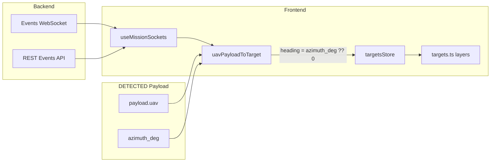

# Direction Projection Logic — API Support and Data Flow

## Summary

**The API supports it.** The direction projection (orange fan-shaped cone and dashed line) is driven by `azimuth_deg` from the backend. The frontend only implements the rendering logic; the heading value comes from real-time telemetry.

---

## Data Flow




---

## 1. API Support

The backend sends `azimuth_deg` in the DETECTED event payload:

```93:93:src/types/aeroshield.ts
  azimuth_deg?: number;
```

- **Source**: WebSocket events stream (`mission_event` with `event_type: "DETECTED"`)
- **Payload**: `payload.uav` of type `DetectedUavPayload`
- **Field**: `azimuth_deg` — degrees (0–360) from the detection device

---

## 2. Mapping to Target

`[src/stores/targetsStore.ts](src/stores/targetsStore.ts)` maps `azimuth_deg` to `heading`:

```41:41:src/stores/targetsStore.ts
    heading: uav.azimuth_deg ?? 0,
```

If `azimuth_deg` is missing, `heading` defaults to `0`.

---

## 3. Rendering Logic (Frontend)

`[src/components/map/layers/targets.ts](src/components/map/layers/targets.ts)` uses `target.heading` for three visuals:


| Visual              | Function                             | Usage                                                            |
| ------------------- | ------------------------------------ | ---------------------------------------------------------------- |
| Orange cone (fan)   | `generateThreatCone()`               | Uses `heading` as center bearing; draws a ±30° wedge (60° total) |
| Dashed line         | `targetsToPredictedPathGeoJSON()`    | Uses `heading` as bearing; draws a 4 km line from drone position |
| Drone icon rotation | `targetsToGeoJSON()` → `icon-rotate` | `["get", "heading"]` rotates the drone icon                      |


**Cone geometry** (lines 8–27):

```8:27:src/components/map/layers/targets.ts
function generateThreatCone(target: Target, angle = 60): GeoJSON.Position[] {
  const { coordinates, heading, distanceKm } = target;

  // Tactical wedge: 1.5–3 km (was 5–12+ km, too large at map scale)
  const dynamicDistance = Math.min(3, Math.max(1.5, distanceKm * 0.1));

  const steps = 12; // smoother curve
  const halfAngle = angle / 2;
  const points: GeoJSON.Position[] = [coordinates];

  for (let i = 0; i <= steps; i++) {
    const bearing = heading - halfAngle + (i / steps) * angle;

    points.push(destinationPoint(coordinates, bearing, dynamicDistance));
  }

  points.push(coordinates);

  return points;
}
```

**Predicted path** (lines 52–74):

```52:74:src/components/map/layers/targets.ts
function targetsToPredictedPathGeoJSON(
  targets: TargetWithNeutralized[],
): GeoJSON.FeatureCollection<GeoJSON.LineString> {
  return {
    type: "FeatureCollection",
    features: targets
      .filter((t) => !t.neutralized)
      .map((target) => {
        const end = destinationPoint(
          target.coordinates,
          target.heading,
          PREDICTED_PATH_KM,
        );
        return {
          type: "Feature" as const,
          properties: { id: target.id, classification: target.classification },
          geometry: {
            type: "LineString" as const,
            coordinates: [target.coordinates, end],
          },
        };
      }),
  };
}
```

---

## 4. End-to-End Flow

1. **WebSocket**: `[useMissionSockets.ts](src/hooks/useMissionSockets.ts)` receives `mission_event` with `event_type: "DETECTED"`.
2. **Mapping**: `uavPayloadToTarget()` converts `payload.uav` to `Target` with `heading: uav.azimuth_deg ?? 0`.
3. **Store**: `addOrUpdateTarget(target)` updates Zustand `targetsStore`.
4. **Map**: `MapContainer` reads `apiTargets` from the store and passes them to `updateTargetLayersData()`.
5. **Layers**: GeoJSON sources are updated; Mapbox renders cone, path, and rotated icon from `heading`.

---

## 5. REST Fallback

When WebSockets are unavailable, `[useMissionEvents.ts](src/hooks/useMissionEvents.ts)` polls `GET /api/v1/missions/{id}/events?event_type=DETECTED` and uses the same `payload.uav` structure, including `azimuth_deg`.

---

## Conclusion

- **API**: Provides `azimuth_deg` in DETECTED `payload.uav`.
- **Frontend**: Maps it to `heading` and uses it for cone, path, and icon rotation.
- **Hardcoding**: Only the cone angle (60°), path length (4 km), and cone distance (1.5–3 km) are fixed; the direction itself comes from the API.

