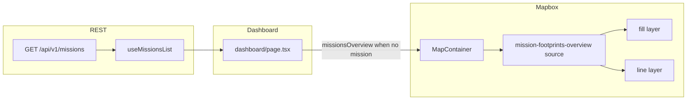

# Mission footprint polygons on landing map

## Is it possible?

**Yes.** The app already types each mission with `border_geojson: GeoJSON.Polygon | null` (see `src/types/aeroshield.ts`). If `GET /api/v1/missions` returns that field populated for each mission, the client can build a **GeoJSON FeatureCollection** (one polygon per mission) and Mapbox can draw **fill + outline** with **per-feature colors** (for example `lineColor` in `properties` and `["get", "lineColor"]` in layer paint).

**You only need backend changes** if the list endpoint omits geometry or always sends `null` (common for small list payloads). Then either extend the list response with `border_geojson`, or add a lighter field (centroid or bbox) and optionally draw something other than true footprints.

**Scope for this plan:** **polygons only** (real footprints). Circles at centroids are optional later.

---

## Why it does not happen today

1. **No overview layer:** The single-mission border uses `setBorderLayer` in `src/components/map/layers/border.ts`, fed by **map features** after a mission is selected — not by the missions list.
2. **Landing path clears map overlays:** When `missionId` is null, `MapContainer` runs an effect that clears assets, zones, and `setBorderLayer(map, null)` — so nothing from missions appears on the map.
3. **List data never reaches the map:** The dashboard does not pass `useMissionsList` results into `MapContainer`, so even with polygons in memory, the map never sees them.

---

## How we will implement (polygons)

Aligns with project rules: **Mapbox owns drawing**; use a **GeoJSON source + layers**; REST list is already TanStack Query — passing the **latest list array** into the map as props is fine (it is not live WebSocket telemetry).

1. **Utility** (`src/utils/missionsOverviewFootprints.ts`): `buildMissionsFootprintsFeatureCollection(missions: Mission[])`. For each mission with valid `Polygon` `border_geojson` (closed outer ring), emit a `Feature` with `properties: { missionId, name, lineColor }` and cycle `lineColor` across a fixed palette.
2. **Layer helper** (`src/components/map/layers/missionFootprintsOverview.ts`): Same pattern as `border.ts`: one source id (`mission-footprints-overview`), `setMissionFootprintsOverviewLayer(map, featureCollection)`. Add **fill** (semi-transparent) + **line** (dashed outline), `slot: "top"`, `fill-color-use-theme` / `line-color-use-theme`: `"disabled"`, **emissive** paint so Standard basemap does not wash them out.
3. `**MapContainer`**
  - New optional prop: `missionsOverview?: Mission[] | null` (or a minimal `{ id; name; border_geojson }[]`).
  - Keep `**missionsOverviewRef`** updated each render (same pattern as `missionIdRef`) so `**mountOperationalLayers`** (runs after intro and after **style reload**) can call the setter with the correct collection when there is no active mission id.
  - At end of `**mountOperationalLayers`**, after existing border/assets/zones setup: if no mission id, `setMissionFootprintsOverviewLayer(map, build(...))`, else empty FeatureCollection.
  - `**useEffect`** when `missionId`, `missionsOverview`, `mapReady`, `isIntroComplete` change: update overview source data the same way (handles list loading after map is ready).
  - When `**missionId` is set**, overview data should be **cleared** (empty FeatureCollection) so only the selected mission border from map features shows.
4. `**dashboard/page.tsx`**: `const { data: missionsList } = useMissionsList();` Pass e.g. `missionsOverview={activeMissionId ? null : missionsList ?? undefined}` into `MapContainer`.

**Naming:** Keep the overview source **separate** from `mission-border` to avoid clashes with the single-mission border from map features.

---

## Edge cases / product notes

- **Missions outside landing bounds:** `LANDING_REGION_BOUNDS` in `src/utils/missionOverview.ts` may crop the view; footprints elsewhere are still valid but require **pan/zoom** unless you later add “fit all mission bounds” behavior.
- **MultiPolygon:** If the API ever returns `MultiPolygon`, extend the builder to split or normalize (current type is `Polygon` only).
- **Invalid rings:** Skip features with fewer than four positions on the outer ring.

---

## Verification before / while building

- Inspect a real list response: confirm `border_geojson` is present and is a valid polygon for test missions.
- After implementation: land on dashboard with no mission selected — you should see colored fills/outlines; select a mission — overview footprints clear and mission border from features behaves as today.

