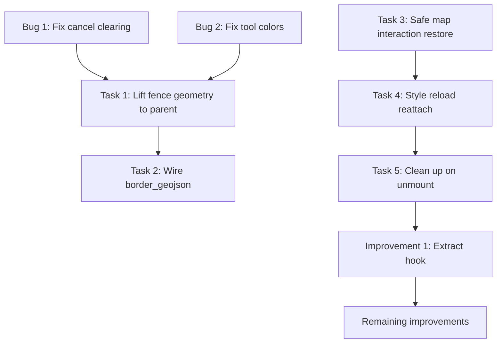

# Create Mission and Fence Flow - Code Review and Fix Plan

## Active Bugs (Priority 1)

### Bug 1: Cancel not consistently clearing draft fence from map

**Files:** [`CreateFenceWorkspace.tsx`](src/components/missions/CreateFenceWorkspace.tsx)

The cancel handler (line 667) sets `draftGeometry` to `null` via React state and also directly calls `updateFenceLayers(mapInstance, null, savedFences)`. However, the React effect at line 368-371 that syncs layers may re-fire with stale state due to React batching, causing a flicker or re-paint of the draft.

**Root cause:** Two separate paths update the same Mapbox source -- direct imperative calls in handlers AND the declarative React effect. When cancel fires, the imperative clear may get overridden by the effect re-running with not-yet-flushed state.

**Fix:**
- Remove the direct `updateFenceLayers` call from the cancel handler. Instead, rely solely on the React effect (line 368-371) for all layer syncing. The cancel handler should only reset React state (`setDraftGeometry(null)`, `setDrawingState(null)`, etc.).
- Add a `useEffect` cleanup or a `flushSync` guard so that when `showMetadata` transitions to `false` and `draftGeometry` transitions to `null`, the layer sync effect runs deterministically in one pass.
- Similarly audit `handleMouseMove` which also calls `setDraftLayerData` directly -- consider routing all Mapbox data updates through the single effect to avoid dual-path conflicts.

---

### Bug 2: Tool-specific colors not rendering consistently

**Files:** [`CreateFenceWorkspace.tsx`](src/components/missions/CreateFenceWorkspace.tsx)

The Mapbox paint expressions use `["coalesce", ["get", "fillColor"], "#FF30C6"]` which correctly reads feature `properties.fillColor`. The `buildPolygonFeature` function sets these properties when `colors` is provided. However:

- The React effect at lines 551-587 (drawingState sync) always uses the hardcoded mode color constants, which is correct.
- But `handleMouseMove` directly calls `setDraftLayerData` with its own feature that also has colors. These two paths can race.
- The saved fence label layer always uses `"text-color": "#FF30C6"` (hardcoded pink) regardless of tool mode -- labels should inherit the fence's tool color.

**Fix:**
- Unify the data flow: all draft/saved geometry updates should flow through React state -> single layer sync effect.
- Add a `color` or `outlineColor` property to the saved label features so the label layer can use `["get", "outlineColor"]` to match the fence's tool color.
- Verify that `buildPolygonFeature` is always called with colors when constructing features for save (currently it is -- `activeColors` from closure).

---

## Stabilization Tasks (Priority 2)

### Task 1: Lift saved fence geometry into parent mission state

**Files:** [`CreateFenceWorkspace.tsx`](src/components/missions/CreateFenceWorkspace.tsx), [`CreateMissionForm.tsx`](src/components/missions/CreateMissionForm.tsx), [`MissionSelector.tsx`](src/components/missions/MissionSelector.tsx)

Currently, `CreateFenceWorkspace` only passes `string[]` (fence names) back via `onFencesChange`. The `SavedFence` type (name + altitude + mode + geometry) is local to the workspace component.

**Changes:**
- Extract the `SavedFence` type to a shared location (e.g., `src/types/aeroshield.ts` or a new `src/types/fence.ts`).
- Change `onFencesChange` prop from `(fences: string[]) => void` to `(fences: SavedFence[]) => void`.
- Update `CreateMissionForm` and `MissionSelector` to receive and store full `SavedFence[]` instead of `string[]`.
- The fence list UI can derive `name` from the objects for display while retaining geometry for submission.

### Task 2: Wire `border_geojson` into mission creation

**Files:** [`MissionSelector.tsx`](src/components/missions/MissionSelector.tsx), [`lib/api/missions.ts`](src/lib/api/missions.ts)

The `createMission` API already accepts `border_geojson?: GeoJSON.Polygon | null`. The `handleCreate` function in `MissionSelector` (line 107-129) only sends `{ name, aop: null }`.

**Changes:**
- After Task 1 is done, compose the fence geometries into a single `border_geojson` polygon (or use the first/selected fence).
- Pass it in the `createMission` payload.

### Task 3: Restore map interactions safely

**Files:** [`CreateFenceWorkspace.tsx`](src/components/missions/CreateFenceWorkspace.tsx) (function `applyMapDrawingMode`, lines 287-312)

The function currently disables 5 interactions on enter and **re-enables all 5** on exit. This is dangerous because the dashboard may have intentionally disabled some of those interactions (e.g., `doubleClickZoom` or `dragRotate`).

**Fix:**
- Before disabling interactions, snapshot which ones are currently enabled.
- On restore, only re-enable the interactions that were enabled before draw mode started.
- Store the snapshot in a ref so it persists across the draw session.

```typescript
// Snapshot before disabling
const snapshot = {
  dragPan: map.dragPan.isEnabled(),
  boxZoom: map.boxZoom.isEnabled(),
  dragRotate: map.dragRotate.isEnabled(),
  doubleClickZoom: map.doubleClickZoom.isEnabled(),
  // touchZoomRotate rotation state
};
```

### Task 4: Reattach fence layers after style reload

**Files:** [`CreateFenceWorkspace.tsx`](src/components/missions/CreateFenceWorkspace.tsx)

If the basemap or light preset changes while fence workspace is active, Mapbox drops all custom sources/layers. Currently there is no `style.load` listener to re-add them.

**Fix:**
- Add a `useEffect` that listens for the `style.load` event on the map instance.
- On `style.load`, call `ensureFenceLayers(map)` then `updateFenceLayers(map, draftGeometry, savedFences)` to restore all fence visuals.
- Clean up the listener on unmount.

### Task 5: Clean up sources/layers on workspace unmount

**Files:** [`CreateFenceWorkspace.tsx`](src/components/missions/CreateFenceWorkspace.tsx) (lines 589-596)

The current unmount effect clears data from sources but does not remove the actual sources and layers from the map. They persist as empty, orphaned entries.

**Fix:**
- On unmount, remove layers first (`map.removeLayer(...)`) then sources (`map.removeSource(...)`), with existence checks.

---

## Code Quality Improvements (Priority 3)

### Improvement 1: Extract drawing logic into a custom hook

**Files:** [`CreateFenceWorkspace.tsx`](src/components/missions/CreateFenceWorkspace.tsx)

The component is 683 lines mixing geometry math, Mapbox imperative calls, React state, and JSX. Extract:
- Geometry helpers (`buildPolygonFeature`, `buildRectanglePoints`, `buildCirclePoints`, etc.) into `src/utils/fenceGeometry.ts`.
- Drawing state + map event handlers into `src/hooks/useFenceDraw.ts`.
- Layer management (`ensureFenceLayers`, `updateFenceLayers`, `clearDraftLayers`) into `src/components/map/layers/fence.ts` (matching the existing layers directory pattern).

### Improvement 2: Fix geographic inaccuracy in circle/distance

**Files:** [`CreateFenceWorkspace.tsx`](src/components/missions/CreateFenceWorkspace.tsx) (lines 129-149)

`distanceBetween` uses Euclidean distance on lat/lng coordinates, and `buildCirclePoints` uses simple cos/sin. Both produce distorted shapes at non-equatorial latitudes.

**Fix:** Use haversine distance and bearing-based point generation (similar to `src/utils/geo.ts` `destinationPoint`). Alternatively, use Turf.js `circle()` and `distance()`.

### Improvement 3: Replace map instance polling with subscription

**Files:** [`CreateFenceWorkspace.tsx`](src/components/missions/CreateFenceWorkspace.tsx) (lines 350-365)

The 150ms `setInterval` polling for `getMap()` is fragile.

**Fix:** Add a `subscribeToMap` function in `mapController.ts` that notifies when the map instance is set, similar to existing `subscribeToPopup`.

### Improvement 4: Remove hardcoded fence placeholder data

**Files:** [`MissionSelector.tsx`](src/components/missions/MissionSelector.tsx) (line 45-46)

`CREATE_FENCE_ITEMS = ["DGCA South Zone", "No-fly Zone", "Fence 001"]` is dummy data that resets on every form open.

**Fix:** Initialize as empty array `[]`. The fence list should only populate from user-created fences.

### Improvement 5: Delete button should work for all fences

**Files:** [`CreateFencePanel.tsx`](src/components/missions/CreateFencePanel.tsx) (line 54)

The delete button only renders for `index === 0`. All fences should be deletable.

**Fix:** Remove the `index === 0` guard.

### Improvement 6: Avoid source/layer ID collision

**Files:** [`CreateFenceWorkspace.tsx`](src/components/missions/CreateFenceWorkspace.tsx) (lines 35, 40)

`SAVED_LABEL_SOURCE_ID` and `SAVED_LABEL_LAYER_ID` are both `"create-fence-saved-label"`. While Mapbox namespaces sources and layers separately, this is confusing.

**Fix:** Rename `SAVED_LABEL_SOURCE_ID` to `"create-fence-saved-label-src"` (or similar).

### Improvement 7: Hard-coded absolute positioning for toolbar and popover

**Files:** [`FenceDrawToolbar.tsx`](src/components/missions/FenceDrawToolbar.tsx) (line 29), [`FenceMetadataPopover.tsx`](src/components/missions/FenceMetadataPopover.tsx) (line 36)

Toolbar uses `left-[410px]`, popover uses `left-[641px] top-[195px]`. These break if the panel width changes.

**Fix:** Use relative positioning based on the parent container width (e.g., `left-full` or calculated from the panel's actual width via a ref or design token).

---

## Suggested Implementation Order



Phase 1 (bugs): Fix cancel + color issues -- directly addresses user-facing broken behavior.
Phase 2 (stabilization): Lift geometry, safe restore, style reload, cleanup.
Phase 3 (quality): Extract hook, geographic accuracy, polling replacement, remaining cleanup.
