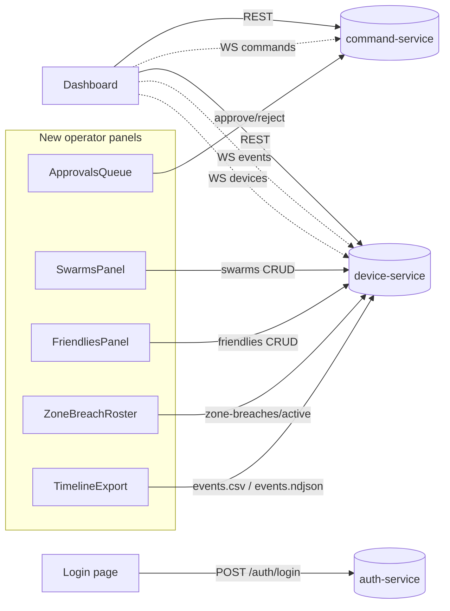
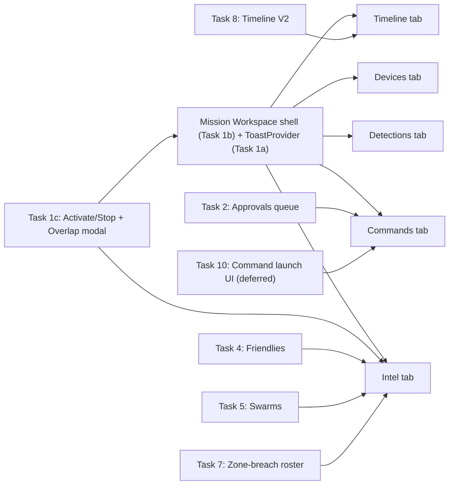

# Operator-Scope API Gap Plan — AeroShield COP

## 1. Executive summary

| Area | API coverage in `docs/API_REFERENCE.md` | What's wired today | Gap |
|---|---|---|---|
| Auth | A.1 | `POST /auth/login` wired via [src/lib/api/auth.ts](src/lib/api/auth.ts) + cookie middleware | None for operator scope |
| Missions (CRUD + activate/stop + overlaps) | B.4 | Create / list / load / `map/features` only | `PATCH`, `activate`, `stop`, `overlaps` missing |
| Mission map features | B.6 | Read via `map/features` | No create/delete yet |
| Zones | B.5 | `POST /zones` direct-called from `MissionSelector` | List/update/delete not used; cache not invalidated; `useCreateZone`/`useDeleteZone` exist but unused |
| Devices + state + config | B.2–B.3 | List, assign, states polling | `configs/by-mission` not rendered |
| Mission events | B.8 + V1 appendix | REST list + WS stream | No `source`/`target_uid`/`zone_id`/CSV filters; no `/events/counts` or `/events/types`; no `X-Total-Count` pagination; no CSV/NDJSON export |
| Annotations (TRACK_RATED / NFZ_BREACH_PREDICTED) | B.8b | In-memory only in `targetsStore` | Not persisted via `POST /annotations` — reloads lose ratings |
| Swarms | B.9 | Nothing | Full CRUD + WS trigger + halo rings missing |
| Friendlies | B.10 | Nothing | Full CRUD + jam-lockout retry missing |
| Commands: create | C.2 | `POST /commands` (4 call sites) | No `idempotency_key`, no 409 `friendly_drone_active` retry dialog with `override_friendly:true` |
| Commands: approve / reject | C.2 + C.4 | `approveCommand` / `rejectCommand` already in client but **no UI call sites** | Pending-approval queue + WS-driven UI |
| Zone-breach active roster | V1 appendix | Nothing | Live tile + dwell timers |
| AAR export (CSV/NDJSON) | V1 appendix | Nothing | Download buttons on timeline |
| WS streams (events, devices, commands) | §6 / B.12 / C.4 | All 3 connected via [src/hooks/useMissionSockets.ts](src/hooks/useMissionSockets.ts) | `command_update` store wiring exists; `SWARM_DETECTED`, `TRACK_RATED`, `NFZ_BREACH`, `ZONE_ENTER`/`EXIT`, `BREACH_RING_ENTERED` need explicit reducers in `missionEventsStore` / `targetsStore` |
| Mission Workspace UI | — | Bottom strip: `RecentCommands` + `MissionTimeline` + `EngagementLog` stacked over the map ([src/components/missions/MissionWorkspace.tsx](src/components/missions/MissionWorkspace.tsx) L78-L131) | No tabbed shell, no mission-scoped Devices tab, no Detections tab slotting, no Intel aggregation |
| Alerts / toasts | — | None (errors go to console / inline text only) | No `ToastProvider`, no `useToast()` — alerts must be added before operator feedback is usable |

Skipped (admin-scope, per your choice): IAM (users / roles / scopes / permissions), protocol catalogue, policy editor, command trace + cleanup.

## 2. Data / control flow after the plan



**UI shell → task map** (from Task 1b onwards, every feature task lands in a specific tab):



## 3. Prerequisites (do these first, once)

- **P0 — Central WS reducer contract. [DONE]** `useMissionSockets` now has one `handleMissionEvent(evt)` that pushes every event into `missionEventsStore` (cap 500) and runs type-specific side-effects on `targetsStore`, `deviceStatusStore`, React Query, and a tiny `missionEventsBus`. See [Section 6 / P0](#p0--centralize-websocket-reducers-done) for exactly what shipped.
- **P1 — Env clarity.** `.env.example` currently mixes HTTP base URLs with IP:port WS URLs. Add `NEXT_PUBLIC_WS_BASE_URL` guidance (already referenced in code) and document the single-gateway fallback.

## 4. Execution order

Ordered so each task depends only on earlier ones. Each task = **one Cursor prompt = one PR**.

0. **Task A — Devices admin list** **[DONE]**
1. **P0 — Centralize WS reducers** **[DONE]** (plus drone-flood follow-up: REST backfill is timeline-only; WS is authoritative for targets)
2. **Task 1 — Mission lifecycle + Workspace tab shell + Toast alerts.** Three sub-deliverables in one task so later features have a stable host:
   - **1a** — Toast/Alert provider (3s auto-dismiss, max 10 stacked)
   - **1b** — Mission Workspace tabbed shell (Timeline / Devices / Detections / Commands / Intel)
   - **1c** — `POST activate` / `POST stop` / `GET overlaps` + CoverageWarningModal, activate button lives in the shell header
3. Approvals queue (closes the biggest safety gap) → lands in the Commands tab
4. Friendly-drone override retry on 409 + command idempotency keys
5. Friendlies panel → lands in the Intel tab
6. Swarms panel + halo rings on map → lands in the Intel tab
7. Operator annotations persistence (TRACK_RATED via `POST /annotations`)
8. Zone-breach active roster tile → lands in the Intel tab
9. Mission timeline V2 (extended filters, counts, pagination, AAR export) → lands in the Timeline tab
10. Polish: zone CRUD cache invalidation, `configs/by-mission` rendering
11. **Task 10 — Command launch UI (deferred)** — full structured command forms + dynamic `payload_schema` forms. Task 1b only scaffolds a placeholder "New command" entry.

## 5. Cursor prompt templates (copy-paste ready)

Every prompt uses the same format so you can fire them sequentially.

```
Read the skill at C:\Users\sandh\.cursor\skills-cursor\canvas\SKILL.md only if I ask for a canvas.

Context files (read first):
- docs/API_REFERENCE.md sections listed below
- src/lib/api/client.ts, src/stores/authStore.ts
- src/styles/driifTokens.ts (tokens — use these for colors/spacing/radii)
- existing reference components listed below

Figma:
- Node URL: <FIGMA_URL>
- Use the user-driif-figma MCP: call get_design_context with this URL first, then adapt to the project's stack. Do NOT generate new designs.

Task: <one-liner>

Endpoints to integrate (from docs/API_REFERENCE.md):
- <method> <path> → <lib file to add/extend>

Deliverables:
- <file list>
- Types in src/types/aeroshield.ts
- TanStack Query hook in src/hooks/...
- UI component under src/components/...
- Wire into dashboard page + existing shell

Acceptance:
- <behaviour>
- No linter errors
- 401 → redirects to /login (via apiFetch in client.ts)
- 403 → hides the control
- 409 and 4xx → shows doc-mapped toast via formatCommandError
```

## 6. Task-by-task prompts

### Task A — Devices admin list (new, built first) [DONE]

**Status:** Shipped. Delivered files (matching the spec below):
- [src/app/dashboard/devices/page.tsx](src/app/dashboard/devices/page.tsx)
- [src/components/devices/DevicesTable.tsx](src/components/devices/DevicesTable.tsx), [DeviceFilterBar.tsx](src/components/devices/DeviceFilterBar.tsx), [EditDeviceModal.tsx](src/components/devices/EditDeviceModal.tsx), [AssignDeviceDialog.tsx](src/components/devices/AssignDeviceDialog.tsx), [DeviceDetailDrawer.tsx](src/components/devices/DeviceDetailDrawer.tsx), [DevicesInventoryOverlay.tsx](src/components/devices/DevicesInventoryOverlay.tsx)
- [src/hooks/useDevices.ts](src/hooks/useDevices.ts) (list + assign mutations), [src/hooks/useDeviceDetail.ts](src/hooks/useDeviceDetail.ts), [src/hooks/useProtocolsList.ts](src/hooks/useProtocolsList.ts), [src/hooks/useDeviceStates.ts](src/hooks/useDeviceStates.ts), [src/hooks/useDeviceLastSeenMap.ts](src/hooks/useDeviceLastSeenMap.ts)
- [src/lib/api/protocols.ts](src/lib/api/protocols.ts); [src/lib/api/devices.ts](src/lib/api/devices.ts) extended with `getDevice` / `patchDevice`.
- `CopShell` left-rail now includes Devices + Missions icons with active state.

Open items carried forward:
- `CONNECTION_MODE` field not submitted (still TBD with backend).
- `DeviceRowActions.tsx` inlined into `DevicesTable.tsx` instead of a separate file.

---

**Context (original spec):** No Figma yet. Visual parity with three old-UI screenshots the user shared: (1) Devices list with Mission / Type / Status / Radar Model filters and Edit | Assign | Un-assign | Open row actions, (2) Edit device modal, (3) Assign device to mission dialog with an `— Unassigned —` option in the mission dropdown. Everything uses `src/styles/driifTokens.ts` and the existing `CopShell` chrome.

**Endpoints (all already documented in `docs/API_REFERENCE.md`):**
- `GET /api/v1/devices?mission_id=&device_type=&status=&protocol=` — §B.2
- `GET /api/v1/missions` — §B.4 (Mission filter + Assign dialog options)
- `GET /api/v1/protocols` — §B.11 (Radar Model filter + Edit modal dropdown; any authenticated user)
- `GET /api/v1/devices/{id}` — §B.2 (hydrate Edit modal / Open drawer)
- `GET /api/v1/devices/{id}/state` — §B.3 (live numbers in Open drawer)
- `PATCH /api/v1/devices/{id}` — §B.2 (Edit, Assign, Un-assign all go through this single route)

**New files:**
- `src/app/dashboard/devices/page.tsx`
- `src/components/devices/DevicesTable.tsx`
- `src/components/devices/DeviceFilterBar.tsx`
- `src/components/devices/DeviceRowActions.tsx`
- `src/components/devices/EditDeviceModal.tsx`
- `src/components/devices/AssignDeviceDialog.tsx` (handles un-assign via the `— Unassigned —` option)
- `src/components/devices/DeviceDetailDrawer.tsx` (the "Open" action target; right-side, live state)
- `src/hooks/useDevicesList.ts` (filtered `GET /devices`)
- `src/hooks/useProtocolsList.ts` (new; read-only)
- `src/hooks/useDeviceDetail.ts` (device + state, `refetchInterval` 5s while drawer open)
- `src/hooks/useUpdateDevice.ts` (mutation for Edit + Assign + Un-assign; invalidates `["devices"]` and `["mission", id]`)
- `src/lib/api/protocols.ts` (new)
- Extend `src/lib/api/devices.ts` → add `getDevice`, `patchDevice`

**Sidebar wiring (small refactor of `CopShell`):**
- Convert the existing left rail into an icon stack: **Devices** (new) → **Missions** (existing) → **Approvals** (placeholder route until Task 2) → **Admin** (placeholder, disabled — out of scope).
- Active icon highlighted per the screenshot (accent bar + label).
- `Devices` icon route → `/dashboard/devices`.

**Edit modal (matches screenshot #2):** fields in two-column grid
- `NAME` — text
- `COLOUR` — palette chips (None, cyan, amber, violet, emerald, red, pink, blue, gold, crimson) + custom hex input. Stored as `#RRGGBB` per §B.2 regex.
- `DEVICE ROLE` — `DETECTION` / `JAMMER` / `Detection + Jammer` (DETECTION_JAMMER)
- `RADAR MODEL` — from `GET /protocols`, shows `display_name`, writes `name`
- `DETECTION RADIUS (M)` — number, > 0
- `JAMMER RADIUS (M)` — number, > 0
- `DETECTION BEAM (°)` — number 1–360; empty = use protocol default (hint line: `360 = omni · <360 = wedge`)
- `JAMMER BEAM (°)` — same rules
- `LATITUDE` / `LONGITUDE` — numeric; footnote "or drag the radar on the Mission map to reposition"
- `CONNECTION MODE` — radio pair `Edge-connector` / `Direct radar`. **TBD:** this field is not in the current `DeviceCreate`/`DeviceOut` schema in `docs/API_REFERENCE.md`. We will render the control but only submit the field if a matching key lands in the protocol (I'll flag a TODO in code and keep it read-only disabled if the backend rejects it). You may want to confirm the field name with the backend team before wiring the PATCH.
- Also include (below the scroll fold in the screenshot) `breach_green_m`, `breach_yellow_m`, `breach_red_m` from §B.2 so all editable fields are covered.

**Assign dialog (matches screenshots #3 + #4):**
- Title: `Assign device to mission`
- Body: `Device: <monitor_device_id>` above a single `MISSION` dropdown
- First option is `— Unassigned —` (sends `mission_id: null` on save)
- Other options from `GET /missions` sorted by `name`
- Save → `PATCH /devices/{id}` → invalidate `["devices"]`, `["mission", previousMissionId]`, `["mission", newMissionId]`

**Row actions:** `Edit` (opens modal), `Assign` (opens dialog empty), `Un-assign` (opens the same dialog preselected to `— Unassigned —` so the operator can confirm; matches screenshot behaviour), `Open` (opens right-side detail drawer).

**Open drawer (no screenshot; proposed default — call out if you want different):**
- Header: device name + `monitor_device_id` + status badge
- Live cards (5s refetch): `last_seen`, `battery_pct`, `power_mode`, `temp_c`, `humidity_pct`, `azimuth_deg`, `elevation_deg`, `lat/lon/alt_m` from `GET /devices/{id}/state`
- Secondary card: `ip_port`, `gateway_ip`, `band_range[]` from `GET /devices/{id}/config` (§B.3)
- Footer CTA: `Open on map` → navigates to `/dashboard?mission=<mission_id>&focus_device=<id>` (map focus already possible via existing `mapController`)

**Acceptance:**
- `/dashboard/devices` renders 3 Himalaya rows (demo fixture or live) matching the list screenshot's columns and chips.
- Applying `Mission = All missions + Type = DETECTION_JAMMER` filters via a single `GET /devices` call with query params.
- Editing a name and clicking `Save changes` closes the modal, shows the new name in the row within one tick (optimistic), and a devtools 200 `PATCH` with only the changed fields in the body.
- Assigning to `— Unassigned —` clears the Mission cell and removes the device from that mission's map workspace after invalidation.
- `Open` drawer battery / azimuth values tick every 5 s while the drawer is open; close = stop polling.
- Operator without `device:update` sees the row actions reduced to `Open` only (per §F guardrails).

**Cursor prompt (copy-paste):**
```
Read first:
- docs/API_REFERENCE.md §B.2, §B.3, §B.4 (missions list), §B.11, §F
- src/lib/api/client.ts, src/lib/api/devices.ts, src/stores/authStore.ts
- src/styles/driifTokens.ts, src/components/cop-shell/CopShell.tsx
- Three screenshots referenced in the plan (Devices list, Edit modal, Assign dialog)

No Figma MCP calls for this task — match the three screenshots directly with driifTokens.

Task: Build the Devices admin list page and its Edit / Assign / Open flows exactly as specified in Task A of .cursor/plans/operator-api-gap-plan_8558442c.plan.md.

Produce every file listed under "New files" + the CopShell sidebar refactor. Use TanStack Query hooks with invalidation on every PATCH. Gate row actions with authStore.permissions.

Acceptance: list renders live devices with filters; Edit saves only changed fields; Assign dialog's first option is `— Unassigned —`; Un-assign preselects that option; Open drawer polls state every 5 s; no linter errors.
```

### P0 — Centralize WebSocket reducers [DONE]

**Status:** Shipped. What actually landed (cite when writing later tasks):

- **Types — [src/types/aeroshield.ts](src/types/aeroshield.ts):** added `TrackRatedPayload`, `ThreatEscalationPayload`, `NfzBreachPredictedPayload`, `BreachRingEnteredPayload`, `DeviceAzimuthPayload`, `DeviceOnlineEventPayload`, `DeviceOfflineEventPayload`, `SwarmDetectedPayload` (+ `TrackRatedStatus`, `TrackRatedPriority`, `BreachRing`).
- **Target rating/threat — [src/types/targets.ts](src/types/targets.ts):** optional `rating` and `threat` fields on `Target`; `classification` is untouched.
- **[src/stores/targetsStore.ts](src/stores/targetsStore.ts):** `applyTrackRating` (no-op if target missing; `UNRATED` + `priority == null` drops `rating`), `applyThreatEscalation`.
- **[src/stores/missionEventsStore.ts](src/stores/missionEventsStore.ts):** `MAX_EVENTS` 100 → 500.
- **[src/stores/deviceStatusStore.ts](src/stores/deviceStatusStore.ts):** extra `azimuth_deg` / `elevation_deg` / `azimuth_updated_at`; `updateDeviceAzimuth` merge without touching `status`; `setDeviceStatus` now merges over the previous entry (preserves azimuth on plain status updates).
- **New [src/stores/missionEventsBus.ts](src/stores/missionEventsBus.ts):** `subscribe` / `publish`; used today for `SWARM_DETECTED` (raw payload, per the plan).
- **[src/hooks/useMissionSockets.ts](src/hooks/useMissionSockets.ts):** single `handleMissionEvent` switch — `DETECTED` / `UAV_DETECTED` / `TRACK_UPDATE` / `TRACK_LOST` / `TRACK_END` / `TRACK_RATED` / `THREAT_ESCALATION` / `SWARM_DETECTED` / `DEVICE_ONLINE` / `DEVICE_OFFLINE` / `DEVICE_AZIMUTH` / `MISSION_ACTIVATED` / `MISSION_STOPPED` / `MISSION_AUTO_JAM_STOP`. Mission lifecycle invalidates `missionsKeys.detail(mid)` and `missionsKeys.all`. NFZ / zone / breach events are timeline-only (side-effects arrive in Task 7).
- **Drone-flood follow-up — [src/hooks/useMissionEvents.ts](src/hooks/useMissionEvents.ts):** the REST fallback no longer writes to `targetsStore`. It is a **one-shot 15-minute backfill** for the timeline (`from_ts = now - 15m`, `limit 500`, no 5s poll). Live targets come only from the WS.
- `yarn build` passes; no new lints.

What downstream tasks can now rely on:
- `targets[i].rating` / `targets[i].threat` populated from the wire → Task 5 (swarm recolour) and Task 6 (annotations fold) both read from here.
- `missionEventsBus.subscribe("SWARM_DETECTED", fn)` → Task 5 uses this to invalidate `["swarms", missionId]`.
- `deviceStatusStore.byDeviceId[id].azimuth_deg` → Task 9 / map device tick.
- `queryClient.invalidateQueries(missionsKeys.detail(id))` already fires on `MISSION_*` → Task 1 activate/stop button doesn't need extra wiring.

---

**Why (original spec):** Every later task depends on `missionEventsStore` receiving more than `DETECTED`, and `targetsStore` receiving rating/threat updates from the wire.

**Prompt (kept for record):**
```
Task: Expand the mission_event reducer so the three WebSockets populate stores completely.

Files to edit:
- src/hooks/useMissionSockets.ts — add a single `handleMissionEvent(evt)` helper dispatching on evt.event_type
- src/stores/missionEventsStore.ts — append every event, keep last 500
- src/stores/targetsStore.ts — on TRACK_RATED, merge {status, priority} into target by target_uid; on THREAT_ESCALATION, stamp score+level
- src/types/aeroshield.ts — extend MissionEvent payload union with the shapes from docs/API_REFERENCE.md §E.1

Event types to handle (push to missionEventsStore always, plus side-effects below):
- DETECTED / UAV_DETECTED → existing target upsert
- TRACK_RATED → targetsStore.reclassify(target_uid, status, priority)
- SWARM_DETECTED → trigger swarmsQuery.refetch() (event bus pattern); see Task 6
- NFZ_BREACH / ZONE_ENTER / ZONE_EXIT / NFZ_BREACH_PREDICTED → nothing beyond timeline push yet
- BREACH_RING_ENTERED / BREACH_UNJAMMED_EXIT → nothing extra yet
- DEVICE_AZIMUTH / DEVICE_OFFLINE / DEVICE_ONLINE → deviceStatusStore upsert
- MISSION_ACTIVATED / MISSION_STOPPED / MISSION_AUTO_JAM_STOP → invalidate mission load query

Acceptance:
- devtools shows events landing in missionEventsStore in real time
- TRACK_RATED from another tab updates the drone icon colour within <1 s
```

### Task 1 — Mission lifecycle + Workspace tab shell + Toast alerts

This task ships in **one PR with three sub-deliverables** because later feature tasks (Approvals, Friendlies, Swarms, Timeline V2, Zone-breach roster) all need the shell and toast infrastructure to mount into.

> **`old-ui/` scope reminder:** the `old-ui/` references below are **behavioural only** — API shapes, event flow, data fields displayed, localStorage keys. **All visual design (layout, colors, spacing, typography, motion) comes from Figma + `driifTokens.ts`** per [.cursor/rules/design.md](.cursor/rules/design.md) and [.cursor/rules/figma-build.md](.cursor/rules/figma-build.md). Never copy old-ui layouts, grids, or styling verbatim.

#### Task 1a — Toast / Alert provider

**Figma node needed:** toast container + 4 states (success / error / info / warning). `<FIGMA_NODE_URL>` required before the styling pass.

**From `old-ui/` (behaviour only):** the `ToastProvider` + `useToast()` API shape in [old-ui/src/app/components/Toasts.tsx](old-ui/src/app/components/Toasts.tsx) L49-L62 — context-based, imperative `push(kind, message, durationMs)`, auto-dismiss via `setTimeout`, stacked in a fixed container. Do **not** copy the Tailwind classes at L77-L92 (`bg-emerald-500/90`, `ring-emerald-400`, etc.); those come from Figma.

**From user spec:** default `durationMs = 3000`, stack cap **10**. Four kinds: `success | error | info | warning`.

**Deliverables:**
- `src/components/alerts/ToastProvider.tsx` (context + state + render)
- `src/components/alerts/useToast.ts` (`success / error / info / warning / push`)
- Wrap [src/app/layout.tsx](src/app/layout.tsx) (or the closest client boundary) once, above `QueryProvider`.
- Add types to `src/types/aeroshield.ts` if the toast payload union needs documenting.

**Acceptance:**
- `useToast().success("Mission activated")` renders a toast that auto-dismisses after 3s.
- Queueing 12 toasts in a loop leaves at most 10 visible; oldest are evicted.
- Visuals match Figma pixel-exact (spacing, radius, colours via `driifTokens.ts`).

---

#### Task 1b — Mission Workspace tabbed shell

**Figma node needed:** full mission-active workspace — tab bar, header with Activate, tab body scroll behaviour, responsive breakpoints. `<FIGMA_NODE_URL>` required.

**From `old-ui/` (behaviour only):**
- Tab IDs and persistence key — [old-ui/src/app/pages/MissionWorkspacePage.tsx](old-ui/src/app/pages/MissionWorkspacePage.tsx) L228-L241: `"timeline" | "devices" | "detections" | "commands" | "intel"`, persisted under `localStorage["aeroshield.workspace.tab"]` (reuse the key so existing operator browsers pick up their last tab).
- **What lives in each tab** (content model, not visual model):
  - **Timeline** → `MissionTimeline` body (Task 8 replaces internals).
  - **Devices** → mission's devices + `deviceStatusStore` (health / last-seen / battery / azimuth / telemetry). Field list for tiles derived from [old-ui/.../DevicePanel.tsx](old-ui/src/app/components/DevicePanel.tsx) L258-L500.
  - **Detections** → existing `DetectionsPanel` ([src/components/detections/DetectionsPanel.tsx](src/components/detections/DetectionsPanel.tsx)).
  - **Commands** → existing `RecentCommands` + an Approvals-queue slot (filled by Task 2) + a disabled "New command" button that says "Coming soon" (detailed UI is Task 10).
  - **Intel** → 4 empty section slots (Coverage overlaps / Swarms / Friendlies / Jams) — Coverage overlaps content filled by Task 1c; Swarms by Task 5; Friendlies by Task 4; Jams derived from `targetsStore` in a follow-up.

**Do NOT copy from old-ui:** the `grid-cols-12 / col-span-8 / col-span-4` split, the in-sidebar KPI strip, tile dimensions, colours, tab-bar visuals, the bottom-of-sidebar scroll model. All of that is Figma-driven.

**Deliverables:**
- Refactor [src/components/missions/MissionWorkspace.tsx](src/components/missions/MissionWorkspace.tsx) L78-L131 — remove the current stacked bottom strip (`RecentCommands + MissionTimeline + EngagementLog`).
- New `src/components/missions/MissionWorkspaceTabs.tsx` — tab bar + active-tab router (`localStorage`-persisted state). Tab-bar visuals from Figma.
- New `src/components/missions/MissionDevicesTab.tsx` — mission-scoped, reads `cachedMission.devices` + `useDeviceStatusStore`. Does **not** call any new API.
- New `src/components/intel/IntelTab.tsx` — section-slot layout from Figma; ships with the Coverage-overlaps section populated (from Task 1c) and placeholder sections for Swarms/Friendlies/Jams.
- New `src/components/commands/CommandsTab.tsx` — wraps the existing `RecentCommands` plus approval-queue and new-command-button slots.

**Acceptance:**
- Selecting a mission shows the new tab shell with the last-used tab pre-selected from `localStorage`.
- Each tab renders the components listed above; no visual regression vs Figma.
- `EngagementLog`, the `REAL-TIME DATA / THREAT PROFILING / COUNTER-UAS EFFECTORS` badge strip, and any other legacy bottom-of-map UI are either placed per Figma or removed.
- No change in data hooks used — `useMissionLoad`, `useMissionSockets`, `useMissionEvents` still power the tabs.

---

#### Task 1c — Mission lifecycle (activate / stop / overlaps)

**Figma nodes needed:** Activate button state variants inside the shell header, Stop button variant, CoverageWarningModal (severity chip styling for CRITICAL / HIGH / LOW). `<FIGMA_NODE_URL>` required.

**From `old-ui/` (behaviour only):** `apiActivateMission` / `apiStopMission` + "block Activate when `overlaps.counts.CRITICAL > 0`" flow at [old-ui/.../MissionWorkspacePage.tsx](old-ui/src/app/pages/MissionWorkspacePage.tsx) L339-L344 and L878-L909. Do **not** copy the Activate button placement or styling from old-ui — the button lives wherever Figma puts it inside the shell header from Task 1b.

**Endpoints (already documented):**
- `POST /api/v1/missions/{id}/activate`
- `POST /api/v1/missions/{id}/stop`
- `PATCH /api/v1/missions/{id}` (name edits)
- `GET  /api/v1/missions/{id}/overlaps`

**Deliverables:**
- `src/lib/api/missions.ts` → add `activateMission`, `stopMission`, `getMissionOverlaps` (`updateMission` already exists).
- `src/hooks/useMissions.ts` → add `useActivateMission`, `useStopMission` (invalidate `["mission", id]`).
- `src/hooks/useMissionOverlaps.ts` → `useQuery`, enabled when mission status !== ACTIVE.
- `src/components/missions/MissionActivationButton.tsx` — rendered inside `MissionWorkspaceTabs` header slot.
- `src/components/missions/CoverageWarningModal.tsx` — renders `warnings[]` with severity chips; visual from Figma.
- Wire success / failure to `useToast()` (1a).
- Populate the Intel tab's **Coverage overlaps** section from `useMissionOverlaps`.

**Acceptance:**
- Click Activate → if `overlaps.counts.CRITICAL > 0` opens `CoverageWarningModal` (blocks activate); otherwise mutation runs and `MissionOut.status` flips to ACTIVE.
- Stop button visible only when ACTIVE.
- Success toast on activate / stop; error toast on failure.
- `PATCH` name inline-edits mission title and invalidates the list query.
- Intel tab's Coverage-overlaps section lists current overlap warnings, updates on mission reload.

---

**Combined Cursor prompt (all three sub-deliverables, one PR):**
```
Read first:
- .cursor/rules/design.md, .cursor/rules/figma-build.md (Figma-first, no redesign)
- docs/API_REFERENCE.md §B.4 (activate, stop, overlaps, PATCH)
- src/components/missions/MissionWorkspace.tsx (current bottom-strip layout to refactor)
- src/styles/driifTokens.ts (all styling must come from these tokens)
- Behavioural references (DO NOT copy visuals):
  - old-ui/src/app/components/Toasts.tsx L49-L62 (provider API shape)
  - old-ui/src/app/pages/MissionWorkspacePage.tsx L228-L241 (tab ids + localStorage key), L339-L344, L878-L909 (lifecycle flow)

Figma (required for every sub-deliverable):
- 1a Toast: <FIGMA_NODE_URL_TOAST>
- 1b Tab shell: <FIGMA_NODE_URL_SHELL>
- 1c Activate/Stop + CoverageWarningModal: <FIGMA_NODE_URL_LIFECYCLE>
- Use user-driif-figma MCP: call get_design_context for each URL first. Do NOT invent visuals.

Task: Ship Task 1 from .cursor/plans/operator-api-gap-plan_8558442c.plan.md as one PR with three sub-deliverables (1a toasts, 1b tab shell, 1c lifecycle). Every visual decision must come from Figma + driifTokens.ts; old-ui is reference for APIs/behaviour ONLY.

Deliverables: see Task 1a/1b/1c sections for exact file lists. Tab IDs and localStorage key match old-ui for operator continuity. Toast defaults: 3000ms, max 10 stacked, kinds success|error|info|warning.

Acceptance (combined):
- useToast() works, 3s auto-dismiss, max 10 visible.
- Mission selection shows tabbed shell with last-used tab persisted.
- Activate blocks on CRITICAL overlaps (modal from Figma); success/failure routed through toast.
- Stop visible only when ACTIVE.
- Intel tab's Coverage-overlaps section populated; Swarms/Friendlies/Jams are empty slots.
- No visual regression vs Figma; no borrowed layout from old-ui.
- yarn build green; no lints.
```

### Task 2 — Approvals queue (live, WS-driven)

**Lands in:** Commands tab (slot above `RecentCommands`, rendered by `CommandsTab.tsx` from Task 1b).

**Figma nodes:** Pending approvals list with approve/reject actions, reason input modal.

**Prompt:**
```
Task: Build the Pending Approvals queue and wire approve/reject.

Read: docs/API_REFERENCE.md §C.1, §C.2, §C.4
Figma: <FIGMA_NODE_URL> — call get_design_context first.

Endpoints (client already exists):
- GET  /api/v1/commands?mission_id={id}&status=PENDING_APPROVAL
- POST /api/v1/commands/{id}/approve
- POST /api/v1/commands/{id}/reject

Deliverables:
- src/hooks/useApprovalsQueue.ts — useQuery(status=PENDING_APPROVAL), refetch on WS command_update
- src/hooks/useApproveCommand.ts / useRejectCommand.ts — mutations (invalidate queue + commandsStore)
- src/components/commands/ApprovalsPanel.tsx — uses driifTokens; row: command_type • device name • approved_count/required_approvals progress • Approve / Reject buttons (hide if user lacks command:approve perm — read authStore.permissions)
- src/components/commands/RejectReasonDialog.tsx — required reason textarea
- Slot into CopShell right rail above RecentCommands

Wire WS: extend the command_update handler in useMissionSockets to
  queryClient.invalidateQueries(["commands", missionId, "PENDING_APPROVAL"])
when status ∈ {PENDING_APPROVAL, SENDING, SUCCEEDED, REJECTED}.

Acceptance:
- Operator with only command:request sees the queue but Approve/Reject buttons are absent
- Two-approval policy: first approve increments counter; second flips status to SENDING; WS update removes row live
- Reject shows the reason on the RecentCommands row
```

### Task 3 — Friendly-drone 409 retry + idempotency keys on `POST /commands`

**Prompt:**
```
Task: Handle 409 friendly_drone_active retry and add idempotency keys.

Read: docs/API_REFERENCE.md §C.2 step 4, §D.0, Appendix "Commands — idempotency", §F.
Figma: <FIGMA_NODE_URL for "Friendly drone in area" modal> — call get_design_context first.

Files:
- src/types/aeroshield.ts → extend CommandRequest with optional idempotency_key, payload.override_friendly?:boolean
- src/lib/formatCommandError.ts → detect { error: "friendly_drone_active", friendlies: [...] } in 409 body (ApiClientError should already carry body)
- src/components/commands/FriendlyLockoutDialog.tsx (new) — lists friendlies, "Override and send" button
- Call sites to retry-on-409 with override_friendly:true:
    - src/lib/engageJamCommand.ts
    - src/components/commands/PopupControls.tsx
    - src/components/commands/BandRangeEditor.tsx (only if command_type is jam-family)
- Generate idempotency_key for auto-fired commands (none today) and leave null for operator commands per §Commands-idempotency doc.

Acceptance:
- First JAM_START against a protected UID shows modal; "Override and send" POSTs with override_friendly:true
- Commands list shows the override written into COMMAND_REQUESTED event
- Operator commands still have idempotency_key=null (verified in devtools)
```

### Task 4 — Friendlies panel

**Lands in:** Intel tab → "Friendlies" section slot (scaffolded empty by Task 1b).

**Figma nodes:** Friendlies list + "Add friendly" form + inline edit row.

**Prompt:**
```
Task: Friendly drones registry panel (per mission).

Read: docs/API_REFERENCE.md §B.10
Figma: <FIGMA_NODE_URL> — call get_design_context first.

Endpoints (new file):
- src/lib/api/friendlies.ts
  - listFriendlies(missionId, include_inactive?) → FriendlyOut[]
  - createFriendly(missionId, body)
  - patchFriendly(missionId, friendlyId, body)  // includes {active:false} to unmark

Deliverables:
- src/types/aeroshield.ts → FriendlyOut / FriendlyCreate / FriendlyPatch
- src/hooks/useFriendlies.ts (queries + mutations, invalidation)
- src/components/friendlies/FriendliesPanel.tsx (driifTokens, matches AssetsPanel visual language)
- src/components/friendlies/FriendlyForm.tsx — fields target_uid, label, freq_khz, notes
- Add a "Friendly" quick-tag action in src/components/map/overlays/DroneOverlayCard.tsx (creates a friendly from the current target)

Acceptance:
- Registering a friendly with matching freq blocks a subsequent JAM_START (relies on Task 3 for the 409 retry UX)
- Deactivate (active:false) removes the lockout
```

### Task 5 — Swarms panel + halo rings + WS trigger

**Lands in:** Intel tab → "Swarms" section slot (scaffolded empty by Task 1b). Map halo-ring layer is independent of the tab.

**Figma nodes:** Swarms list with severity chips, "Tag swarm" form, Closed filter; swarm halo ring on map.

**Prompt:**
```
Task: Swarm tagging and auto-swarm rendering.

Read: docs/API_REFERENCE.md §B.9 (especially the WS-trigger client-behaviour note)
Figma: <FIGMA_NODE_URL> — call get_design_context first.

Endpoints (new file):
- src/lib/api/swarms.ts
  - listSwarms(missionId, include_closed)
  - createSwarm(missionId, body)  // source is stamped 'operator' by backend regardless
  - patchSwarm(missionId, swarmId, {closed, closed_reason, label, severity, approach_bearing_deg, target_uids, notes})

Deliverables:
- src/types/aeroshield.ts → SwarmOut, SwarmCreate, SwarmPatch, SwarmSeverity
- src/hooks/useSwarms.ts — useQuery with refetchInterval 10s (per doc); ALSO invalidate on WS SWARM_DETECTED (subscribe via a tiny bus that useMissionSockets publishes to in Task 0)
- src/components/swarms/SwarmsPanel.tsx — cards with severity color, member chips, close button, "new" pulse when refetch triggered by WS
- src/components/swarms/TagSwarmDialog.tsx — multi-select target_uids from current targets, severity, approach_bearing_deg (degrees picker), notes
- src/components/map/layers/swarms.ts — render a dashed halo polygon around the members' bounding circle per swarm (color by severity); use SwarmOut[]
- Register layer in MapContainer

Acceptance:
- After tagging a swarm, each member drone recolours to HIGH threat within <1 s (TRACK_RATED side-effect delivered by Task 0)
- AUTO swarm posted by detection-service appears as a new card + map halo within ~1 s of SWARM_DETECTED WS event
- Closing a swarm removes the halo and chips; re-detection within ~20 s adds a fresh card (redetected badge optional)
```

### Task 6 — Persist operator annotations (TRACK_RATED + NFZ_BREACH_PREDICTED)

**Prompt:**
```
Task: Write operator ratings to the server so they survive reloads.

Read: docs/API_REFERENCE.md §B.8b, §E.1 TRACK_RATED & NFZ_BREACH_PREDICTED
Figma: not needed (reuses existing rating control)

Endpoints:
- POST /api/v1/missions/{id}/annotations

Deliverables:
- src/lib/api/annotations.ts → postAnnotation(missionId, {event_type, device_id?, payload})
- src/hooks/useRateTarget.ts → mutation that:
    1) optimistic update to targetsStore (existing reclassify)
    2) POST annotation with event_type=TRACK_RATED and payload {target_uid, status, priority}
    3) on success do nothing extra (WS will re-broadcast and confirm)
    4) on error roll back and toast
- Replace the current in-memory-only rating calls in:
    - src/components/map/overlays/DroneOverlayCard.tsx
    - src/components/detections/DetectionsPanel.tsx
    - src/components/panels/TrackingPanel.tsx
- On mission load, after the initial events fetch, fold the latest TRACK_RATED per target_uid into targetsStore (per doc note in §E.1)

Acceptance:
- Rate a target as CONFIRMED / HIGH, reload page → target still shows CONFIRMED/HIGH
- Second browser tab sees the rating within <1 s (WS rebroadcast)
```

### Task 7 — Zone-breach active roster tile

**Lands in:** Intel tab → "Breaches" section (new slot added alongside Coverage / Swarms / Friendlies / Jams).

**Figma nodes:** Active-breaches card list with dwell timers.

**Prompt:**
```
Task: Live zone-breach roster tile.

Read: docs/API_REFERENCE.md Appendix "Zone breaches — events" and "active roster"
Figma: <FIGMA_NODE_URL> — call get_design_context first.

Endpoints:
- GET /api/v1/missions/{id}/zone-breaches/active?stale_seconds=60

Deliverables:
- src/lib/api/zoneBreaches.ts → getActiveZoneBreaches(missionId, staleSeconds?)
- src/types/aeroshield.ts → ActiveZoneBreach
- src/hooks/useActiveZoneBreaches.ts — refetchInterval 5s + refetch on WS NFZ_BREACH / ZONE_ENTER / ZONE_EXIT
- src/components/breaches/ZoneBreachRoster.tsx — card per row, zone_label + target_name + dwell ticker (client-side tick from entered_at)
- Slot near DetectionsPanel

Acceptance:
- Entering a no_fly zone in sim adds a card within 1s; exiting removes it within ~staleSeconds
- Dwell timer advances every second client-side even without WS traffic
```

### Task 8 — Mission timeline V2: extended filters, counts, pagination, CSV/NDJSON export

**Lands in:** Timeline tab — replaces the current `MissionTimeline` body inside the shell from Task 1b.

**Figma nodes:** Timeline filter bar (types multi-select, date range, source, target_uid), "showing N of M" footer, Export menu.

**Prompt:**
```
Task: Upgrade mission events list to the V1-appendix contract.

Read: docs/API_REFERENCE.md Appendix "Events audit" + "AAR export"
Figma: <FIGMA_NODE_URL> — call get_design_context first.

Endpoints:
- GET /api/v1/missions/{id}/events  (extended filters, X-Total-Count header)
- GET /api/v1/missions/{id}/events/counts
- GET /api/v1/missions/{id}/events/types
- GET /api/v1/missions/{id}/events.csv    (download)
- GET /api/v1/missions/{id}/events.ndjson (download)

Deliverables:
- src/lib/api/client.ts → expose response headers from apiFetch when needed (return {data, response} variant or a separate helper)
- src/lib/api/missionEvents.ts → extend listMissionEvents params: event_type (CSV), device_id, target_uid, zone_id, source, limit, offset; return {items, total}
- add getEventCounts, getEventTypes, downloadEventsCsv, downloadEventsNdjson (streaming: fetch → blob → save via <a download>)
- src/hooks/useMissionEventsAudit.ts — paginated query with total
- src/components/panels/MissionTimeline.tsx → replace current panel with filter bar + paginated list + "Showing X of Y"
- Export menu buttons: CSV / NDJSON

Acceptance:
- Filtering by source=zone-breach and event_type=NFZ_BREACH,ZONE_ENTER updates the list and counts
- Downloaded CSV filename uses Content-Disposition; contents respect current filters
```

### Task 9 — Polish: zone CRUD invalidation, `configs/by-mission` surface

**Prompt:**
```
Task: Cleanup pass.

Read: docs/API_REFERENCE.md §B.3, §B.5

1) Switch src/components/missions/MissionSelector.tsx to use useCreateZone from src/hooks/useZones.ts (so the ["mission", id] and ["zones", id] queries invalidate).
2) Add listZones read on mission load and render existing zones via layers/zones.ts (don't rely solely on the /map/features aggregate).
3) src/hooks/useDeviceConfigs.ts → GET /api/v1/devices/configs/by-mission/{id}; surface band_range + ip_port + attack_mode in ConfigureRadarHealthTabContent.
4) Health rollup (§E.2): add deviceHealth computer in src/utils/deviceHealth.ts (ONLINE/DEGRADED/ALARM/OFFLINE) and colour the StatusBadge accordingly.

Acceptance:
- Creating a zone in the workspace immediately re-renders without a manual refresh
- Radar config tab shows the current band plan read from the server
```

### Task 10 — Command launch UI (deferred; scaffold only in Task 1b)

**Lands in:** Commands tab — replaces the "New command (coming soon)" button scaffolded by Task 1b.

**Why deferred:** The legacy [old-ui/src/app/components/CommandPanel.tsx](old-ui/src/app/components/CommandPanel.tsx) is ~35 KB and combines three concerns (hard-coded structured forms, DB-policy-driven dynamic forms, per-command capability gating). We intentionally ship Task 1 → Task 9 first so the operator loop closes, then tackle command launch UI as a focused task.

**`old-ui/` scope reminder:** port **APIs, field lists, form shapes, and behaviour** from the references below. **Do not port visual layout.** Each form's UI must come from a dedicated Figma node.

**Reference files (behaviour only):**
- [old-ui/src/app/components/CommandPanel.tsx](old-ui/src/app/components/CommandPanel.tsx) — capability fetch (L273-L296), DB-policy merge over presets (L298-L368), POST dispatch + approval path (L370-L402), friendly-lockout retry (L407-L440), BAND_RANGE_QUERY poll (L714-L764), Mission vs Diagnostics split (L480-L508).
- [old-ui/src/app/components/PayloadForm.tsx](old-ui/src/app/components/PayloadForm.tsx) — structured form set `JAM_START`, `JAM_STOP`, `ATTACK_MODE_SET`, `IP_SET`, `TURNTABLE_POINT`, `TURNTABLE_DIR`, `BAND_RANGE_SET` (L18-L26).
- [old-ui/src/app/components/SchemaForm.tsx](old-ui/src/app/components/SchemaForm.tsx) — renderer for DB-driven `payload_schema`.

**New endpoints to wire (not in the new project yet):**
- `GET /api/v1/commands/capabilities` — per-protocol supported `command_type[]`.
- `GET /api/v1/policies` — per-command `payload_schema`, `required_approvals`, defaults.

**Deliverables (outline; detailed prompt when Task 10 starts):**
- `src/lib/api/capabilities.ts`, `src/lib/api/policies.ts`.
- `src/types/aeroshield.ts` → `PolicyRow`, `PolicyPayloadSchema`, `PolicyPayloadField` (mirroring old-ui `types/command.ts` / `api/command.api.ts`).
- `src/components/commands/CommandLaunchPanel.tsx` — Mission vs Diagnostics dropdown, hardcoded structured forms for the 7 commands above, fallback `SchemaForm` for policy-only commands, raw JSON textarea last-resort.
- Integrates with Task 3 friendly-lockout retry and Task 2 approvals progress.

**Explicit non-goals for Task 10:** admin policy editor, protocol catalogue UI, command trace / cleanup. Those remain out of the operator scope.

## 7. Cross-cutting guardrails (apply to every task)

- **`old-ui/` scope (STRICT):** `old-ui/` is a reference for **APIs, WS reducers, data fields shown, and behavioural contracts ONLY**. All visual design (layout, grids, colors, spacing, radii, typography, motion) comes from **Figma + [src/styles/driifTokens.ts](src/styles/driifTokens.ts)** per [.cursor/rules/design.md](.cursor/rules/design.md) and [.cursor/rules/figma-build.md](.cursor/rules/figma-build.md). **Never copy `old-ui/` component layouts, grids, Tailwind class strings, or styling verbatim.** If a Figma node is not provided for a sub-task, pause and ask — do not invent designs.
- **Auth:** always go through `apiFetch` in [src/lib/api/client.ts](src/lib/api/client.ts); it handles Bearer + base URL.
- **Permissions:** read `authStore.permissions` before rendering action buttons. Hide, don't disable, per §F.
- **Error mapping:** extend [src/lib/formatCommandError.ts](src/lib/formatCommandError.ts) for the new error codes (`friendly_drone_active`, `command_not_valid_for_device_type`, `command_not_supported_by_protocol`).
- **Tokens:** all new UI pulls from [src/styles/driifTokens.ts](src/styles/driifTokens.ts) so the Figma designs stay consistent.
- **Query keys:** use tuple keys `["commands", missionId, status]`, `["swarms", missionId]`, `["friendlies", missionId]`, `["zone-breaches", missionId]`, `["events", missionId, filters]` — makes WS-triggered invalidation trivial.
- **No admin endpoints** touched in this plan (IAM, protocols, policies, command delete/cleanup) — queued for a separate admin plan.

## 8. Unused client code to keep or retire

Already written but currently unused — will be consumed by the tasks above:

- `approveCommand`, `rejectCommand` → Task 2
- `updateMission` → Task 1
- `useCreateZone`, `useDeleteZone`, `listZones`, `updateZone` → Task 9
- `getDeviceConfigs` → Task 9
- `updatePolicy` → out of scope (admin)
- `targetsStore.reclassifyTarget` (tri-state `FRIENDLY | ENEMY | UNKNOWN`) is still the in-memory operator annotation path; Task 6 replaces it with `POST /annotations` + WS fold into `rating`.
- `targetsStore.applyTrackRating` / `applyThreatEscalation` are live from P0 but no UI reads `rating` / `threat` yet — Tasks 5 and 6 will.

## 9. Open items to confirm

- **Task A:** `CONNECTION_MODE` (Edge-connector / Direct radar) is not in the documented `DeviceCreate`/`DeviceOut` schema. Confirm the backend field name before wiring the PATCH — otherwise we render the control read-only and skip it on submit. *(Still open; Task A shipped without it.)*
- **Task A:** `Open` drawer shape — the old UI had no screenshot for this. Plan assumed a right-side live-state drawer; that is what shipped. Ping if you'd rather it navigate to a dedicated route.
- **Tasks 1–9:** Figma file URL / node IDs for each panel (I've left `<FIGMA_NODE_URL>` placeholders).
- **Task 5:** Whether swarm halos should be drawn as a true bounding circle or as a convex hull — the API ships only `target_uids`, so the client computes geometry from the current target positions.

## 10. Change log

- **P0 WS reducers + drone-flood fix (current pass).** Centralized `handleMissionEvent`; added `missionEventsBus`; bumped `MAX_EVENTS` to 500; extended `Target` with `rating`/`threat` and `DeviceStatusEntry` with azimuth fields; REST `useMissionEvents` is now a one-shot 15-minute timeline backfill (no longer seeds `targetsStore`), fixing the "200 historical drones on mission select" flood. `yarn build` green.
- **Task A — Devices admin list.** Shipped (see Task A section for file list and follow-ups).
- **Plan update (this pass).** Expanded Task 1 to three sub-deliverables (1a Toast provider, 1b Mission Workspace tabbed shell with Timeline / Devices / Detections / Commands / Intel tabs, 1c lifecycle + overlaps). Annotated Tasks 2 / 4 / 5 / 7 / 8 with their landing tab. Added deferred Task 10 — Command launch UI. Added a strict `old-ui/` scope guardrail to §7: references for APIs + behaviour only, visuals come from Figma + `driifTokens.ts`. Informed by review of legacy `old-ui/` (`MissionWorkspacePage.tsx`, `Toasts.tsx`, `CommandPanel.tsx`, `DetectionsPanel.tsx`, `TimelinePanel.tsx`, `DevicePanel.tsx`, `command.api.ts`, `device.api.ts`).
