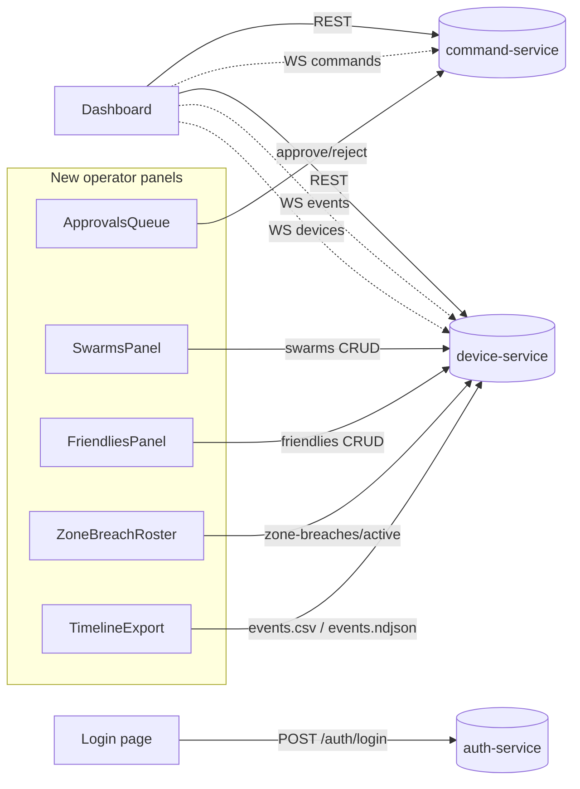
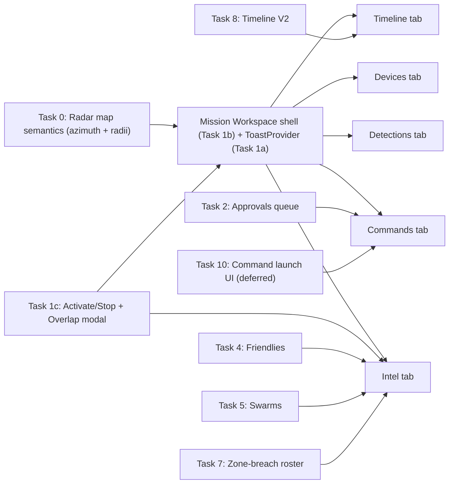

# Operator-Scope API Gap Plan — AeroShield COP

## 0. Master plan (canonical doc)

**This file is the single master implementation plan.** Other files are supporting references only:

- [.cursor/plans/api_and_oldui_gap_review.plan.md](api_and_oldui_gap_review.plan.md) — prompts merged here; keep file only if you want a duplicate Figma registry, otherwise rely on §6 tasks below.
- [.cursor/plans/oldui-api-gap.md](oldui-api-gap.md) — phased checklist / PRD mapping; cross-check against this master for status.
- [.cursor/plans/driif-implementation-plan.md](driif-implementation-plan.md) — deep component inventory vs `oldui/`; use when scoping Task 11+.

**API docs:** Prefer **section numbers and paths from [docs/API_GUIDE.md](../../docs/API_GUIDE.md)** when implementing (integrator-complete, V2.2.x). Use [docs/API_REFERENCE.md](../../docs/API_REFERENCE.md) where this plan still cites §B/§C — align query params and responses with API_GUIDE if the two differ.

## 1. Executive summary

| Area | API coverage in `docs/API_REFERENCE.md` | What's wired today | Gap |
|---|---|---|---|
| Auth | A.1 | `POST /auth/login` wired via [src/lib/api/auth.ts](src/lib/api/auth.ts) + cookie middleware | None for operator scope |
| Missions (CRUD + activate/stop + overlaps) | B.4 | Create / list / load / `map/features`; `activateMission` / `stopMission` / `getMissionOverlaps`; `PATCH` name; CoverageWarningModal on CRITICAL overlaps | None critical for operator loop; polish in Task 9 |
| Mission map features | B.6 | Read via `map/features` | No create/delete yet |
| Zones | B.5 | `POST /zones` direct-called from `MissionSelector` | List/update/delete not used; cache not invalidated; `useCreateZone`/`useDeleteZone` exist but unused |
| Devices + state + config | B.2–B.3 | List, assign; `getDeviceStates` + **8s poll**; **REST → `deviceStatusStore`** on mission open (`useMissionDeviceStatesHydration`) so map/panels match old-ui when WS is quiet | `configs/by-mission` not fully surfaced in Configure Radar (Task 9) |
| Mission events | B.8 + V1 appendix | REST list + WS stream | No `source`/`target_uid`/`zone_id`/CSV filters; no `/events/counts` or `/events/types`; no `X-Total-Count` pagination; no CSV/NDJSON export |
| Annotations (TRACK_RATED / NFZ_BREACH_PREDICTED) | B.8b | In-memory only in `targetsStore` | Not persisted via `POST /annotations` — reloads lose ratings |
| Swarms | B.9 | Nothing | Full CRUD + WS trigger + halo rings missing |
| Friendlies | B.10 | Nothing | Full CRUD + jam-lockout retry missing |
| Commands: create | C.2 | `POST /commands` (4 call sites) | No `idempotency_key`, no 409 `friendly_drone_active` retry dialog with `override_friendly:true` |
| Commands: approve / reject | C.2 + C.4 | `approveCommand` / `rejectCommand` already in client but **no UI call sites** | Pending-approval queue + WS-driven UI |
| Zone-breach active roster | V1 appendix | Nothing | Live tile + dwell timers |
| AAR export (CSV/NDJSON) | V1 appendix | Nothing | Download buttons on timeline |
| WS streams (events, devices, commands) | §6 / B.12 / C.4 | All 3 connected via [src/hooks/useMissionSockets.ts](src/hooks/useMissionSockets.ts) | `command_update` store wiring exists; `SWARM_DETECTED`, `TRACK_RATED`, `NFZ_BREACH`, `ZONE_ENTER`/`EXIT`, `BREACH_RING_ENTERED` need explicit reducers in `missionEventsStore` / `targetsStore` |
| Mission Workspace UI | — | **Shipped:** **Task 1e** — primary operator surface is **left [`MissionDetailOverlay`](../../src/components/missions/MissionDetailOverlay.tsx)** (Info / Timeline / Assets / Detections); **[`MissionSessionHost`](../../src/components/missions/MissionSessionHost.tsx)** holds WS + [`EngageOverlay`](../../src/components/map/overlays/EngageOverlay.tsx) with **no right rail**. **[`MissionWorkspace`](../../src/components/missions/MissionWorkspace.tsx)** / [`MissionWorkspaceTabs`](../../src/components/missions/MissionWorkspaceTabs.tsx) remain for reference or reuse, not mounted on dashboard. **Plus:** Activate / Stop / overlaps, `CoverageWarningModal`; **Assets** = [`MissionDevicesTab`](../../src/components/missions/MissionDevicesTab.tsx); **Devices tab** behaviours unchanged in that component | **Optional:** extract shared assets inner panel with [`DevicesInventoryOverlay`](../../src/components/devices/DevicesInventoryOverlay.tsx); **Commands tab** still deferred; Command launch UI Task 10 |
| Alerts / toasts | — | `ToastProvider` + `useToast()` (stack cap, auto-dismiss); command/mission errors routed through toasts where wired | Extend coverage to every mutation; visual Figma pass |

Skipped (admin-scope, per your choice): IAM (users / roles / scopes / permissions), protocol catalogue, policy editor, command trace + cleanup — except **Task 14** (optional commander/admin track) when product scopes it.

**Note:** Column "API coverage" cites `API_REFERENCE.md` section IDs for historical continuity; verify exact paths and fields in **`docs/API_GUIDE.md`** when implementing.

### 1.1 Completed in recent passes (rolling summary)

- **P0, Task A, Task 0 (core), Task 1 (1a–1c):** Central mission-event WS reducers; devices admin list; radar map semantics (azimuth-driven wedges, gradients, breach rings); `ToastProvider` / `useToast`; tabbed `MissionWorkspaceTabs`; **Activate / Stop**, `GET overlaps`, **`CoverageWarningModal`** (blocks activate on CRITICAL), Intel “Coverage overlaps” section.
- **Map / radar:** Live bearing from `deviceStatusStore` plus **`radarAzimuthKinematics`** ([src/utils/radarAzimuthKinematics.ts](../../src/utils/radarAzimuthKinematics.ts)) — extrapolates rotation between sparse samples like old-ui `useRadarKinematics` (duplicate azimuth ignores wall-clock silence so wedges do not snap back every ~1.5s). **north “spike” removed** — ring-fill bands use a non-zero inner radius (true annulus). Breach **fills** + lines; detection wedge **white** gradient + jammer **amber**; omnidirectional beam uses narrow **boresight** wedge; **D20** protocol uses FE-only sweep when turntable azimuth absent. **`GET /protocols`** defaults folded into GeoJSON via [radarAssetsGeoJSON.ts](../../src/utils/radarAssetsGeoJSON.ts).
- **Device state parity with old UI:** [`useMissionDeviceStatesHydration`](src/hooks/useMissionDeviceStatesHydration.ts) runs [`useDeviceStates`](src/hooks/useDeviceStates.ts) on the mission workspace and merges `GET .../devices/states/by-mission/{id}` into [`deviceStatusStore`](src/stores/deviceStatusStore.ts) (telemetry + [`readAzimuthFromDeviceStatePayload`](src/utils/deviceHealth.ts)) so wedges and panels populate on load and stay in sync when another client moves the turntable and WS is quiet.
- **Devices tab (behavioural old-ui parity):** [`MissionDeviceAimControls`](src/components/missions/MissionDeviceAimControls.tsx), [`MissionDeviceDiagnostics`](src/components/missions/MissionDeviceDiagnostics.tsx), [`MissionDeviceLiveStateGrid`](src/components/missions/MissionDeviceLiveStateGrid.tsx), [`deviceHealth.ts`](src/utils/deviceHealth.ts) rollups; WS path still merges `device_state_update.state` via [`useMissionSockets`](src/hooks/useMissionSockets.ts).
- **Misc:** Command error / 409 detail handling improvements; toast spacing token fix.
- **Task P — Foundation [DONE]:** [`apiJsonWithHeaders`](src/lib/api/client.ts) / [`apiBlob`](src/lib/api/client.ts), GET `_ts` + no-cache; [`listMissionEventsWithTotal`](src/lib/api/missionEvents.ts) + export helpers; create-mission [`site_id`](src/components/missions/MissionSelector.tsx) + [`isMissionBorderInsideSite`](src/utils/missionBorderInSite.ts) + `aop` + radar PATCH-after-assign; types in [`aeroshield.ts`](src/types/aeroshield.ts). Frontmatter `t-pref-foundation` **completed**.
- **COP dashboard chrome (2026-05) [done for current scope]:** [SettingsOverlay](src/components/cop-shell/SettingsOverlay.tsx) — map display controls; labeled [WsStatusIndicator](src/components/status/WsStatusIndicator.tsx) (events / devices / commands). [AccountOverlay](src/components/cop-shell/AccountOverlay.tsx) — persisted `username` in [authStore](src/stores/authStore.ts) + logout; `CopTopBar` removed. [CopShell](src/components/cop-shell/CopShell.tsx) — `onSettingsStackSelect` (gear vs user flyouts aligned with `driifTokens`); single top-right notifications control toggles overall detections overlay (standalone detection icon removed); `POSITION.bellRight` / `bellTop` match logo side/top inset. Frontmatter **`t-cop-dashboard-chrome`** → **completed**.
- **Task 1d — map chrome [DONE]:** [MapLegendPanel](src/components/map/MapLegendPanel.tsx) + [mapLayerGroups.ts](src/components/map/mapLayerGroups.ts) / [useMapLayerToggles.ts](src/hooks/useMapLayerToggles.ts) — zones / detection / jammer / breach toggles, `aeroshield.missionMap.layers` + collapsible legend (**`aeroshield:map-legend-expanded`**). **Legend UI (2026-05):** layers **FAB** at **`POSITION.bellRight`**, vertically centered; **drawer slides in from the right** (aligned with bell/detections gutter); **no map dimming**; **close** control in header; **FAB hidden** while open; [MapContainer](src/components/map/MapContainer.tsx) applies `layout.visibility` after `mountOperationalLayers` and on toggle; [assets.ts](src/components/map/layers/assets.ts) `radar-sweep-detection` / `radar-sweep-jammer`. Frontmatter **`t1d-ws-legend`** → **completed**.
- **Devices / COP loading UX [DONE]:** [InlineLoadIndicator](src/components/ui/InlineLoadIndicator.tsx) — shared spinner + label (`align` optional). [DevicesInventoryOverlay](src/components/devices/DevicesInventoryOverlay.tsx) shows **loading assets** until `useDevicesList` resolves (no empty flash). Swapped inline “Loading…” for **InlineLoadIndicator** in [MissionSelector](src/components/missions/MissionSelector.tsx), [MissionCreateSiteSelect](src/components/missions/MissionCreateSiteSelect.tsx), [SelectAssetsWorkspace](src/components/missions/SelectAssetsWorkspace.tsx), [EditDeviceModal](src/components/devices/EditDeviceModal.tsx), [DeviceDetailDrawer](src/components/devices/DeviceDetailDrawer.tsx), [dashboard MapContainer `dynamic` fallback](src/app/dashboard/page.tsx). Frontmatter **`t-ux-loader-legend-polish`** → **completed**.
- **Task 1e — Mission detail HUD [DONE]:** [MissionDetailOverlay](src/components/missions/MissionDetailOverlay.tsx) — tabs **Info** / **Timeline** / **Assets** / **Detections** (Commands omitted); [MissionHudTimelineTab](src/components/missions/MissionHudTimelineTab.tsx) — Figma-style vertical timeline, secondary line lat/long + layout tokens (`missionHudTimelineTimeColWidth`, reduced timeline scroll inset). [MissionSessionHost](src/components/missions/MissionSessionHost.tsx) — `useMissionLoad`, sockets, hydration, `useMissionEvents`, cache sync, **EngageOverlay**; [dashboard/page.tsx](src/app/dashboard/page.tsx) **removed** right-rail `MissionWorkspace`. [MissionSelector](src/components/missions/MissionSelector.tsx) — views `list | create | detail`, `handleLoad` opens detail without closing overlay, width `POSITION.missionHudWidth`. **Header:** back control (same as create mission) → list; **Deselect** clears mission. **Map:** background click does **not** close missions overlay when `activeMissionId` set. [MissionEventToasts](src/components/alerts/MissionEventToasts.tsx) — **error + warning** only (suppresses `TRACK_UPDATE` / info spam). [driifTokens.ts](src/styles/driifTokens.ts) — `missionHud*` colours, `missionHudTimeline*`, `POSITION.missionHudWidth`. **Assets:** [MissionDevicesTab](src/components/missions/MissionDevicesTab.tsx) (shared extract with `DevicesInventoryOverlay` still optional follow-up). **HUD polish (2026-05):** [MissionDeviceAimControls](src/components/missions/MissionDeviceAimControls.tsx) — Engage attack-mode row: no separate “Attack mode” label, dropdowns + **Send** stay on one line (`flex-nowrap` + horizontal scroll if needed); [MissionDeviceDiagnostics](src/components/missions/MissionDeviceDiagnostics.tsx) — live query payloads (e.g. Network) in a stacked, wrap-safe block instead of a single cramped flex row; [MissionDetectionsList](src/components/detections/MissionDetectionsList.tsx) — **Detections** tab: removed the static footer legend for reported / derived / **unknown** (per-row position styling + `title` tooltips unchanged). Frontmatter **`t-mission-overlay-hud`** → **completed**.

### 1.2 Still pending (high level)

| Bucket | Items |
|--------|--------|
| **Task 1d (workspace chrome)** | **[DONE]** WS in Settings; map legend + layer toggles; legend **FAB + right drawer** (`bellRight`), no backdrop dim. Optional: Figma-only pixel pass on `MapLegendPanel` / loaders. |
| **Task 1e (mission HUD)** | **[DONE]** Left missions overlay **detail** view ([`MissionDetailOverlay`](../../src/components/missions/MissionDetailOverlay.tsx)): Info / Timeline / Assets / Detections; **Commands deferred**. [MissionSessionHost](src/components/missions/MissionSessionHost.tsx) + dashboard **no right `MissionWorkspace`**. **Follow-up (optional):** extract shared assets inner content with [`DevicesInventoryOverlay`](src/components/devices/DevicesInventoryOverlay.tsx). Frontmatter **`t-mission-overlay-hud`** **completed**. |
| **Tasks 2–8, 10** | Approvals (2; interim Commands entry after 1e); friendly 409 + idempotency (3); Friendlies (4); Swarms + halos (5); `POST /annotations` (6); zone-breach roster (7); Timeline V2 + export (8); Command launch UI (10). |
| **Task 9 (remainder)** | Zone CRUD invalidation + `listZones` layers; **`configs/by-mission`** in Configure Radar; cache polish. |
| **Task 0 (remainder)** | **Figma / token pass** for radar ring + wedge colours only (behaviour shipped). **Task 11** `RadarModeChip` (rotation × jam). |
| **Task 11 (situational)** | Overlap preview util + Intel overlap pill/detail; command latency overlay; jams panel; full command audit panel; voice alerts stack (utils + `useVoiceAlerts` + Figma). See §6. |
| **Task 12 (DVR)** | `dvr.api` + playback/timeline hooks + Figma scrubber (licensed / when scoped). |
| **Task 13 (post-operator)** | Mission PDF via `apiBlob`; azimuth dial + pitch side-view math; zone action plan; `threat.ts` / `radioBands.ts`; `rebootTracker`; change-password. |
| **Task 14 (optional admin/commander)** | ROE catalogue + DSL, playbooks, sites/boundary, commander overview — separate rollout. |
| **Design** | Figma pass for shipped behaviours where nodes exist. |

## 2. Data / control flow after the plan



**UI shell → task map** (from Task 1b onwards, every feature task lands in a specific tab):



## 3. Prerequisites (do these first, once)

- **P0 — Central WS reducer contract. [DONE]** `useMissionSockets` now has one `handleMissionEvent(evt)` that pushes every event into `missionEventsStore` (cap 500) and runs type-specific side-effects on `targetsStore`, `deviceStatusStore`, React Query, and a tiny `missionEventsBus`. See [Section 6 / P0](#p0--centralize-websocket-reducers-done) for exactly what shipped.
- **P1 — Env clarity.** `.env.example` currently mixes HTTP base URLs with IP:port WS URLs. Add `NEXT_PUBLIC_WS_BASE_URL` guidance (already referenced in code) and document the single-gateway fallback.

## 4. Execution order

Ordered for **mission lifecycle first**, then **operator safety loop**, then **intel/timeline**, then **foundation/chrome** where parallel makes sense, then **extended situational / DVR / admin** tracks.

Each task = **one Cursor prompt = one PR** (split only if you need smaller reviews).

0. **Task A — Devices admin list** **[DONE]**
1. **P0 — Centralize WS reducers** **[DONE]** (REST backfill = timeline-only; WS authoritative for targets)
2. **Task 0 — Radar map semantics** **[DONE]** (behaviour complete; radar-only polish = Figma colours + optional legend/RadarModeChip per §6 Task 0)
3. **Task 1 — Mission lifecycle + Workspace tab shell + Toast** **[DONE]** (1a–1c)
4. **Task P — Foundation (HTTP + types + site_id)** **[DONE]**. Prerequisite for Task 8 helpers is satisfied: `apiJsonWithHeaders`, `apiBlob`, GET cache-bust (oldui parity), `listMissionEventsWithTotal` + export URLs, create-mission `site_id` + border-in-site + `aop` + radar PATCH-after-assign, TS gaps per Task P prompt. **Remaining product work:** consume totals/export in **Task 8** (Timeline); mission PDF in **Task 13**.
5. **Task 1d — WS + map legend / layer toggles** **[DONE]** (WS in Settings; toggles in MapContainer — see §1.1).
6. **Task 1e — Mission detail HUD overlay** **[DONE]** — [`MissionDetailOverlay`](../../src/components/missions/MissionDetailOverlay.tsx) + [`MissionSessionHost`](../../src/components/missions/MissionSessionHost.tsx); right [`MissionWorkspace`](../../src/components/missions/MissionWorkspace.tsx) rail **removed** from [`dashboard/page.tsx`](../../src/app/dashboard/page.tsx). **§6 Task 1e** lists shipped files + follow-ups.
7. **Task 2 — Approvals queue** → Commands surface (**interim** entry until HUD Commands tab; Task 1e **done**)
8. **Task 3 — Friendly 409 retry + idempotency**
9. **Task 4 — Friendlies** → Intel tab
10. **Task 5 — Swarms + halos** → Intel tab + map
11. **Task 6 — Annotations** (`POST /annotations`)
12. **Task 7 — Zone-breach roster** → Intel tab
13. **Task 8 — Timeline V2** (uses Task P `apiJsonWithHeaders` + `apiBlob`; Task P **[DONE]**) → Timeline tab
14. **Task 9 — Polish** (zones invalidation, `configs/by-mission`, etc.)
15. **Task 11 — Situational awareness** (overlaps UI depth, latency, jams, audit, voice) — can split into sub-PRs; mostly Intel / shell / map
16. **Task 10 — Command launch UI (deferred)** → Commands tab
17. **Task 12 — DVR** — when licensed/scoped
18. **Task 13 — Post-operator polish** (PDF, dial, pitch, zone action plan, threat utils, reboot, password)
19. **Task 14 — Admin / commander** — optional separate program

**Flow you asked for:** lifecycle (Task 1) stays **before** approvals (Task 2). **Task P** is **[DONE]**; **Task 1d** is **[DONE]**; **Task 1e** is **[DONE]**; **COP Settings / Account / bell chrome** under **`t-cop-dashboard-chrome`** **[DONE]**.

**Where to start (current repo):** **Task P**, **Task 1d**, and **Task 1e** are **[DONE]**. **Next default:** **Task 2 — Approvals queue** (or Task 8 for Timeline + exports UI consuming `listMissionEventsWithTotal`).

## 5. Cursor prompt templates (copy-paste ready)

Every prompt uses the same format so you can fire them sequentially.

```
Read the skill at C:\Users\sandh\.cursor\skills-cursor\canvas\SKILL.md only if I ask for a canvas.

Context files (read first):
- docs/API_GUIDE.md (primary — verify paths, permissions, payload shapes)
- docs/API_REFERENCE.md (where this plan cites §B/§C appendix tables)
- src/lib/api/client.ts, src/stores/authStore.ts
- src/styles/driifTokens.ts (tokens — use these for colors/spacing/radii)
- Behaviour only from oldui/src/app/... (no layout/styling copy) — paths listed per task in §6

Figma:
- Node URL: <FIGMA_URL>
- Use the user-driif-figma MCP: call get_design_context with this URL first, then adapt to the project's stack. Do NOT generate new designs.

Task: <one-liner>

Endpoints to integrate (confirm in API_GUIDE, then implement):
- <method> <path> → <lib file to add/extend>

Deliverables:
- <file list>
- Types in src/types/aeroshield.ts (or adjacent modules)
- TanStack Query hook in src/hooks/...
- UI component under src/components/...
- Wire into dashboard page + existing shell

Acceptance:
- <behaviour>
- No linter errors
- 401 → redirects to /login (via apiFetch in client.ts)
- 403 → hides the control
- 409 and 4xx → shows doc-mapped toast via formatCommandError
```

## 6. Task-by-task prompts

### Task A — Devices admin list (new, built first) [DONE]

**Status:** Shipped. Delivered files (matching the spec below):
- [src/app/dashboard/devices/page.tsx](src/app/dashboard/devices/page.tsx)
- [src/components/devices/DevicesTable.tsx](src/components/devices/DevicesTable.tsx), [DeviceFilterBar.tsx](src/components/devices/DeviceFilterBar.tsx), [EditDeviceModal.tsx](src/components/devices/EditDeviceModal.tsx), [AssignDeviceDialog.tsx](src/components/devices/AssignDeviceDialog.tsx), [DeviceDetailDrawer.tsx](src/components/devices/DeviceDetailDrawer.tsx), [DevicesInventoryOverlay.tsx](src/components/devices/DevicesInventoryOverlay.tsx)
- [src/hooks/useDevices.ts](src/hooks/useDevices.ts) (list + assign mutations), [src/hooks/useDeviceDetail.ts](src/hooks/useDeviceDetail.ts), [src/hooks/useProtocolsList.ts](src/hooks/useProtocolsList.ts), [src/hooks/useDeviceStates.ts](src/hooks/useDeviceStates.ts), [src/hooks/useDeviceLastSeenMap.ts](src/hooks/useDeviceLastSeenMap.ts)
- [src/lib/api/protocols.ts](src/lib/api/protocols.ts); [src/lib/api/devices.ts](src/lib/api/devices.ts) extended with `getDevice` / `patchDevice`.
- `CopShell` left-rail now includes Devices + Missions icons with active state.

Open items carried forward:
- `CONNECTION_MODE` field not submitted (still TBD with backend).
- `DeviceRowActions.tsx` inlined into `DevicesTable.tsx` instead of a separate file.

---

**Context (original spec):** No Figma yet. Visual parity with three old-UI screenshots the user shared: (1) Devices list with Mission / Type / Status / Radar Model filters and Edit | Assign | Un-assign | Open row actions, (2) Edit device modal, (3) Assign device to mission dialog with an `— Unassigned —` option in the mission dropdown. Everything uses `src/styles/driifTokens.ts` and the existing `CopShell` chrome.

**Endpoints (all already documented in `docs/API_REFERENCE.md`):**
- `GET /api/v1/devices?mission_id=&device_type=&status=&protocol=` — §B.2
- `GET /api/v1/missions` — §B.4 (Mission filter + Assign dialog options)
- `GET /api/v1/protocols` — §B.11 (Radar Model filter + Edit modal dropdown; any authenticated user)
- `GET /api/v1/devices/{id}` — §B.2 (hydrate Edit modal / Open drawer)
- `GET /api/v1/devices/{id}/state` — §B.3 (live numbers in Open drawer)
- `PATCH /api/v1/devices/{id}` — §B.2 (Edit, Assign, Un-assign all go through this single route)

**New files:**
- `src/app/dashboard/devices/page.tsx`
- `src/components/devices/DevicesTable.tsx`
- `src/components/devices/DeviceFilterBar.tsx`
- `src/components/devices/DeviceRowActions.tsx`
- `src/components/devices/EditDeviceModal.tsx`
- `src/components/devices/AssignDeviceDialog.tsx` (handles un-assign via the `— Unassigned —` option)
- `src/components/devices/DeviceDetailDrawer.tsx` (the "Open" action target; right-side, live state)
- `src/hooks/useDevicesList.ts` (filtered `GET /devices`)
- `src/hooks/useProtocolsList.ts` (new; read-only)
- `src/hooks/useDeviceDetail.ts` (device + state, `refetchInterval` 5s while drawer open)
- `src/hooks/useUpdateDevice.ts` (mutation for Edit + Assign + Un-assign; invalidates `["devices"]` and `["mission", id]`)
- `src/lib/api/protocols.ts` (new)
- Extend `src/lib/api/devices.ts` → add `getDevice`, `patchDevice`

**Sidebar wiring (small refactor of `CopShell`):**
- Convert the existing left rail into an icon stack: **Devices** (new) → **Missions** (existing) → **Approvals** (placeholder route until Task 2) → **Admin** (placeholder, disabled — out of scope).
- Active icon highlighted per the screenshot (accent bar + label).
- `Devices` icon route → `/dashboard/devices`.

**Edit modal (matches screenshot #2):** fields in two-column grid
- `NAME` — text
- `COLOUR` — palette chips (None, cyan, amber, violet, emerald, red, pink, blue, gold, crimson) + custom hex input. Stored as `#RRGGBB` per §B.2 regex.
- `DEVICE ROLE` — `DETECTION` / `JAMMER` / `Detection + Jammer` (DETECTION_JAMMER)
- `RADAR MODEL` — from `GET /protocols`, shows `display_name`, writes `name`
- `DETECTION RADIUS (M)` — number, > 0
- `JAMMER RADIUS (M)` — number, > 0
- `DETECTION BEAM (°)` — number 1–360; empty = use protocol default (hint line: `360 = omni · <360 = wedge`)
- `JAMMER BEAM (°)` — same rules
- `LATITUDE` / `LONGITUDE` — numeric; footnote "or drag the radar on the Mission map to reposition"
- `CONNECTION MODE` — radio pair `Edge-connector` / `Direct radar`. **TBD:** this field is not in the current `DeviceCreate`/`DeviceOut` schema in `docs/API_REFERENCE.md`. We will render the control but only submit the field if a matching key lands in the protocol (I'll flag a TODO in code and keep it read-only disabled if the backend rejects it). You may want to confirm the field name with the backend team before wiring the PATCH.
- Also include (below the scroll fold in the screenshot) `breach_green_m`, `breach_yellow_m`, `breach_red_m` from §B.2 so all editable fields are covered.

**Assign dialog (matches screenshots #3 + #4):**
- Title: `Assign device to mission`
- Body: `Device: <monitor_device_id>` above a single `MISSION` dropdown
- First option is `— Unassigned —` (sends `mission_id: null` on save)
- Other options from `GET /missions` sorted by `name`
- Save → `PATCH /devices/{id}` → invalidate `["devices"]`, `["mission", previousMissionId]`, `["mission", newMissionId]`

**Row actions:** `Edit` (opens modal), `Assign` (opens dialog empty), `Un-assign` (opens the same dialog preselected to `— Unassigned —` so the operator can confirm; matches screenshot behaviour), `Open` (opens right-side detail drawer).

**Open drawer (no screenshot; proposed default — call out if you want different):**
- Header: device name + `monitor_device_id` + status badge
- Live cards (5s refetch): `last_seen`, `battery_pct`, `power_mode`, `temp_c`, `humidity_pct`, `azimuth_deg`, `elevation_deg`, `lat/lon/alt_m` from `GET /devices/{id}/state`
- Secondary card: `ip_port`, `gateway_ip`, `band_range[]` from `GET /devices/{id}/config` (§B.3)
- Footer CTA: `Open on map` → navigates to `/dashboard?mission=<mission_id>&focus_device=<id>` (map focus already possible via existing `mapController`)

**Acceptance:**
- `/dashboard/devices` renders 3 Himalaya rows (demo fixture or live) matching the list screenshot's columns and chips.
- Applying `Mission = All missions + Type = DETECTION_JAMMER` filters via a single `GET /devices` call with query params.
- Editing a name and clicking `Save changes` closes the modal, shows the new name in the row within one tick (optimistic), and a devtools 200 `PATCH` with only the changed fields in the body.
- Assigning to `— Unassigned —` clears the Mission cell and removes the device from that mission's map workspace after invalidation.
- `Open` drawer battery / azimuth values tick every 5 s while the drawer is open; close = stop polling.
- Operator without `device:update` sees the row actions reduced to `Open` only (per §F guardrails).

**Cursor prompt (copy-paste):**
```
Read first:
- docs/API_REFERENCE.md §B.2, §B.3, §B.4 (missions list), §B.11, §F
- src/lib/api/client.ts, src/lib/api/devices.ts, src/stores/authStore.ts
- src/styles/driifTokens.ts, src/components/cop-shell/CopShell.tsx
- Three screenshots referenced in the plan (Devices list, Edit modal, Assign dialog)

No Figma MCP calls for this task — match the three screenshots directly with driifTokens.

Task: Build the Devices admin list page and its Edit / Assign / Open flows exactly as specified in Task A of .cursor/plans/operator-api-gap-plan_8558442c.plan.md.

Produce every file listed under "New files" + the CopShell sidebar refactor. Use TanStack Query hooks with invalidation on every PATCH. Gate row actions with authStore.permissions.

Acceptance: list renders live devices with filters; Edit saves only changed fields; Assign dialog's first option is `— Unassigned —`; Un-assign preselects that option; Open drawer polls state every 5 s; no linter errors.
```

### P0 — Centralize WebSocket reducers [DONE]

**Status:** Shipped. What actually landed (cite when writing later tasks):

- **Types — [src/types/aeroshield.ts](src/types/aeroshield.ts):** added `TrackRatedPayload`, `ThreatEscalationPayload`, `NfzBreachPredictedPayload`, `BreachRingEnteredPayload`, `DeviceAzimuthPayload`, `DeviceOnlineEventPayload`, `DeviceOfflineEventPayload`, `SwarmDetectedPayload` (+ `TrackRatedStatus`, `TrackRatedPriority`, `BreachRing`).
- **Target rating/threat — [src/types/targets.ts](src/types/targets.ts):** optional `rating` and `threat` fields on `Target`; `classification` is untouched.
- **[src/stores/targetsStore.ts](src/stores/targetsStore.ts):** `applyTrackRating` (no-op if target missing; `UNRATED` + `priority == null` drops `rating`), `applyThreatEscalation`.
- **[src/stores/missionEventsStore.ts](src/stores/missionEventsStore.ts):** `MAX_EVENTS` 100 → 500.
- **[src/stores/deviceStatusStore.ts](src/stores/deviceStatusStore.ts):** extra `azimuth_deg` / `elevation_deg` / `azimuth_updated_at`; `updateDeviceAzimuth` merge without touching `status`; `setDeviceStatus` now merges over the previous entry (preserves azimuth on plain status updates).
- **New [src/stores/missionEventsBus.ts](src/stores/missionEventsBus.ts):** `subscribe` / `publish`; used today for `SWARM_DETECTED` (raw payload, per the plan).
- **[src/hooks/useMissionSockets.ts](src/hooks/useMissionSockets.ts):** single `handleMissionEvent` switch — `DETECTED` / `UAV_DETECTED` / `TRACK_UPDATE` / `TRACK_LOST` / `TRACK_END` / `TRACK_RATED` / `THREAT_ESCALATION` / `SWARM_DETECTED` / `DEVICE_ONLINE` / `DEVICE_OFFLINE` / `DEVICE_AZIMUTH` / `MISSION_ACTIVATED` / `MISSION_STOPPED` / `MISSION_AUTO_JAM_STOP`. Mission lifecycle invalidates `missionsKeys.detail(mid)` and `missionsKeys.all`. NFZ / zone / breach events are timeline-only (side-effects arrive in Task 7).
- **Drone-flood follow-up — [src/hooks/useMissionEvents.ts](src/hooks/useMissionEvents.ts):** the REST fallback no longer writes to `targetsStore`. It is a **one-shot 15-minute backfill** for the timeline (`from_ts = now - 15m`, `limit 500`, no 5s poll). Live targets come only from the WS.
- `yarn build` passes; no new lints.

What downstream tasks can now rely on:
- `targets[i].rating` / `targets[i].threat` populated from the wire → Task 5 (swarm recolour) and Task 6 (annotations fold) both read from here.
- `missionEventsBus.subscribe("SWARM_DETECTED", fn)` → Task 5 uses this to invalidate `["swarms", missionId]`.
- `deviceStatusStore.byDeviceId[id].azimuth_deg` → Task 9 / map device tick.
- `queryClient.invalidateQueries(missionsKeys.detail(id))` already fires on `MISSION_*` → Task 1 activate/stop button doesn't need extra wiring.

---

**Why (original spec):** Every later task depends on `missionEventsStore` receiving more than `DETECTED`, and `targetsStore` receiving rating/threat updates from the wire.

**Prompt (kept for record):**
```
Task: Expand the mission_event reducer so the three WebSockets populate stores completely.

Files to edit:
- src/hooks/useMissionSockets.ts — add a single `handleMissionEvent(evt)` helper dispatching on evt.event_type
- src/stores/missionEventsStore.ts — append every event, keep last 500
- src/stores/targetsStore.ts — on TRACK_RATED, merge {status, priority} into target by target_uid; on THREAT_ESCALATION, stamp score+level
- src/types/aeroshield.ts — extend MissionEvent payload union with the shapes from docs/API_REFERENCE.md §E.1

Event types to handle (push to missionEventsStore always, plus side-effects below):
- DETECTED / UAV_DETECTED → existing target upsert
- TRACK_RATED → targetsStore.reclassify(target_uid, status, priority)
- SWARM_DETECTED → trigger swarmsQuery.refetch() (event bus pattern); see Task 6
- NFZ_BREACH / ZONE_ENTER / ZONE_EXIT / NFZ_BREACH_PREDICTED → nothing beyond timeline push yet
- BREACH_RING_ENTERED / BREACH_UNJAMMED_EXIT → nothing extra yet
- DEVICE_AZIMUTH / DEVICE_OFFLINE / DEVICE_ONLINE → deviceStatusStore upsert
- MISSION_ACTIVATED / MISSION_STOPPED / MISSION_AUTO_JAM_STOP → invalidate mission load query

Acceptance:
- devtools shows events landing in missionEventsStore in real time
- TRACK_RATED from another tab updates the drone icon colour within <1 s
```

### Task 0 — Radar map semantics (before Task 1)

#### Shipped (current repo)

- **[src/utils/radarAssetsGeoJSON.ts](src/utils/radarAssetsGeoJSON.ts)** — Device → GeoJSON: roles, **`detection_beam_deg` / `jammer_beam_deg`** with **`GET /protocols`** defaults when device fields null (`default_detection_beam_deg`, `default_jammer_beam_deg`, `default_breach_*_m`), **`effectiveBreachRingsKm`**, `protocol` string on features for map behaviour, `buildMergedRadarAssetsGeoJSON`.
- **[src/utils/mapFeatures.ts](src/utils/mapFeatures.ts)** — `/map/features` device rows via `radarPropsFromMapFeatureProps` (same protocol merge path).
- **[src/utils/radarAzimuthKinematics.ts](src/utils/radarAzimuthKinematics.ts)** — Client-side rotation between sparse **`azimuth_deg`** samples (port of old-ui [`useRadarKinematics.ts`](oldui/src/app/hooks/useRadarKinematics.ts)): inferred °/s + rAF advancement; **skip ingest when bearing unchanged** (no `tsDelta < 1500` trap — avoids periodic snap-back); drift/rate-change re-anchor preserved.
- **[src/components/map/MapContainer.tsx](src/components/map/MapContainer.tsx)** — Asset source from `buildMergedRadarAssetsGeoJSON` + protocols catalogue; **no FE-fake turntable azimuth for AS_2.0G** (motion comes from backend samples + kinematics extrapolation only). **D20** uses FE sweep in layer (see below).
- **[src/components/map/layers/assets.ts](src/components/map/layers/assets.ts)** — **`resolveSweepAzimuth`**: smoothed azimuth from kinematics (and **D20** synthetic sweep when protocol is D20); **detection** wedge = **white** gradient polygons; **jammer** wedge = **amber** gradient; **360°** detection ⇒ narrow **boresight** wedge (~40°) for operator cue (differs from old-ui E.6 note where AS_2.0G footprint was drawn as full ring only — intentional Driif/map readability choice). **Breach**: stepped red/yellow/green **fills** + dashed/solid **lines**. Decorative warm annuli + orange dashed rings; lock-on radius rule unchanged. **Ring-fill** inner ratio ~0.02 — **north spike** fix.
- **REST + WS azimuth** — [`readAzimuthFromDeviceStatePayload`](src/utils/deviceHealth.ts); [`useMissionSockets`](src/hooks/useMissionSockets.ts); [`useMissionDeviceStatesHydration`](src/hooks/useMissionDeviceStatesHydration.ts).

#### Task 0 improvements still open (not blocking later tasks)

1. ~~**Protocol catalogue merge**~~ — **Shipped** in `radarAssetsGeoJSON` / `radarPropsFromMapFeatureProps` when `protocols` list is passed from MapContainer / mergers.
2. ~~**Devices tab / commands**~~ — **Shipped:** aim controls + map store parity.
3. **Figma / token pass** — Formal tokens for radar ring + wedge fills/strokes vs inline constants in `assets.ts`.
4. **Optional parity / UX** — **Task 11:** [`RadarModeChip`](oldui/src/app/components/RadarModeChip.tsx) (rotation × jam summary). **Task 13:** AzimuthDial / pitch side view (devices workspace).
5. **Edge cases** — `detection_radius_m` missing → current km fallback; occasional payloads omitting `azimuth_deg` could reset kinematics (prune path); tighten only if observed in production sims.
6. **Code hygiene (optional)** — Back-port kinematics **duplicate-sample-only skip** to [`oldui/.../useRadarKinematics.ts`](oldui/src/app/hooks/useRadarKinematics.ts) for consistency; optional **60 fps** sweep source updates while rotating (today heavy geo refresh ~30 fps throttle).

**Behavioural baseline:** Separate breach vs detection/jammer radii per [MissionMap.tsx](oldui/src/app/components/MissionMap.tsx) + [beam.ts](oldui/src/app/utils/beam.ts) + [effectiveBreachRings](oldui/src/app/utils/threat.ts); **smooth wedge motion** matches old-ui kinematics hook behaviour after the duplicate-reading fix above.

---

### Task 1 — Mission lifecycle + Workspace tab shell + Toast alerts

This task ships in **one PR with three sub-deliverables** because later feature tasks (Approvals, Friendlies, Swarms, Timeline V2, Zone-breach roster) all need the shell and toast infrastructure to mount into.

> **`old-ui/` scope reminder:** the `old-ui/` references below are **behavioural only** — API shapes, event flow, data fields displayed, localStorage keys. **All visual design (layout, colors, spacing, typography, motion) comes from Figma + `driifTokens.ts`** per [.cursor/rules/design.md](.cursor/rules/design.md) and [.cursor/rules/figma-build.md](.cursor/rules/figma-build.md). Never copy old-ui layouts, grids, or styling verbatim.

#### Task 1a — Toast / Alert provider **[SHIPPED — behaviour; Figma polish optional]**

**Figma node needed:** toast container + 4 states (success / error / info / warning). `<FIGMA_NODE_URL>` required before a full styling pass.

**From `old-ui/` (behaviour only):** the `ToastProvider` + `useToast()` API shape in [old-ui/src/app/components/Toasts.tsx](old-ui/src/app/components/Toasts.tsx) L49-L62 — context-based, imperative `push(kind, message, durationMs)`, auto-dismiss via `setTimeout`, stacked in a fixed container. Do **not** copy the Tailwind classes at L77-L92 (`bg-emerald-500/90`, `ring-emerald-400`, etc.); those come from Figma.

**From user spec:** default `durationMs = 3000`, stack cap **10**. Four kinds: `success | error | info | warning`.

**Deliverables:**
- `src/components/alerts/ToastProvider.tsx` (context + state + render)
- `src/components/alerts/useToast.ts` (`success / error / info / warning / push`)
- Wrap [src/app/layout.tsx](src/app/layout.tsx) (or the closest client boundary) once, above `QueryProvider`.
- Add types to `src/types/aeroshield.ts` if the toast payload union needs documenting.

**Acceptance:**
- `useToast().success("Mission activated")` renders a toast that auto-dismisses after 3s.
- Queueing 12 toasts in a loop leaves at most 10 visible; oldest are evicted.
- Visuals match Figma pixel-exact (spacing, radius, colours via `driifTokens.ts`).

---

#### Task 1b — Mission Workspace tabbed shell

**Figma node needed:** full mission-active workspace — tab bar, header with Activate, tab body scroll behaviour, responsive breakpoints. `<FIGMA_NODE_URL>` required.

**From `old-ui/` (behaviour only):**
- Tab IDs and persistence key — [old-ui/src/app/pages/MissionWorkspacePage.tsx](old-ui/src/app/pages/MissionWorkspacePage.tsx) L228-L241: `"timeline" | "devices" | "detections" | "commands" | "intel"`, persisted under `localStorage["aeroshield.workspace.tab"]` (reuse the key so existing operator browsers pick up their last tab).
- **What lives in each tab** (content model, not visual model):
  - **Timeline** → `MissionTimeline` body (Task 8 replaces internals).
  - **Devices** → mission's devices + `deviceStatusStore` (health / last-seen / battery / azimuth / telemetry). Field list for tiles derived from [old-ui/.../DevicePanel.tsx](old-ui/src/app/components/DevicePanel.tsx) L258-L500.
  - **Detections** → live `MissionDetectionsList` in tab + bell overlay; old Figma mock rows in `DetectionsPanel` were replaced.
  - **Commands** → existing `RecentCommands` + an Approvals-queue slot (filled by Task 2) + a disabled "New command" button that says "Coming soon" (detailed UI is Task 10).
  - **Intel** → 4 empty section slots (Coverage overlaps / Swarms / Friendlies / Jams) — Coverage overlaps content filled by Task 1c; Swarms by Task 5; Friendlies by Task 4; Jams derived from `targetsStore` in a follow-up.

**Do NOT copy from old-ui:** the `grid-cols-12 / col-span-8 / col-span-4` split, the in-sidebar KPI strip, tile dimensions, colours, tab-bar visuals, the bottom-of-sidebar scroll model. All of that is Figma-driven.

**Deliverables:**
- Refactor [src/components/missions/MissionWorkspace.tsx](src/components/missions/MissionWorkspace.tsx) L78-L131 — remove the current stacked bottom strip (`RecentCommands + MissionTimeline + EngagementLog`).
- New `src/components/missions/MissionWorkspaceTabs.tsx` — tab bar + active-tab router (`localStorage`-persisted state). Tab-bar visuals from Figma.
- New `src/components/missions/MissionDevicesTab.tsx` — mission-scoped, reads `cachedMission.devices` + `useDeviceStatusStore`. Does **not** call any new API.
- New `src/components/intel/IntelTab.tsx` — section-slot layout from Figma; ships with the Coverage-overlaps section populated (from Task 1c) and placeholder sections for Swarms/Friendlies/Jams.
- New `src/components/commands/CommandsTab.tsx` — wraps the existing `RecentCommands` plus approval-queue and new-command-button slots.
- `src/components/detections/MissionDetectionsList.tsx` + slim `DetectionsPanel.tsx` wrapper; `src/utils/missionEventDisplay.ts` for timeline Device/Location columns (zone-breach + DETECTED payloads).

**Shipped in repo (refined after review; Figma + `driifTokens` — not old-ui chrome):**
- **Placement:** [src/app/dashboard/page.tsx](src/app/dashboard/page.tsx) — mission UI is `absolute` right-rail, same top/right anchor as the Detections overlay (`POSITION.bellRight`, below the bell), `z-[11]` (Detections `z-[12]`).
- **Deselect** button in the shell header (next to mission title) — calls the same `exitMission` as other flows: `setActiveMission(null)`, `setCachedMission(null)`, `clearTargets`, `useMissionEventsStore.clearEvents()`.
- **Header:** mission **status** chip + Activate/Stop (Task 1c) — driven by `cachedMission.status` after mutations / reload.
- **Devices tab (extended):** `MissionDeviceAimControls`, `MissionDeviceDiagnostics`, `MissionDeviceLiveStateGrid`; `useMissionDeviceStatesHydration` in [`MissionWorkspace`](src/components/missions/MissionWorkspace.tsx) for REST device-state sync.
- **Timeline (workspace):** full-height table in the tab panel, no inner “Mission timeline (n)” title bar; columns Event / Device / Location / Time; zone rows use `payload.target_name`, `zone_label`, `uav_lat`/`uav_lon` per API ref.
- **KPI row:** `border` (not `box-shadow`) to avoid first/last card border clipping; tab badges + 10s tick for stale KPIs.

**Acceptance:**
- Selecting a mission shows the new tab shell with the last-used tab pre-selected from `localStorage`.
- Each tab renders the components listed above; no visual regression vs Figma.
- `EngagementLog`, the `REAL-TIME DATA / THREAT PROFILING / COUNTER-UAS EFFECTORS` badge strip, and any other legacy bottom-of-map UI are either placed per Figma or removed.
- Data hooks: `useMissionLoad`, `useMissionSockets`, `useMissionEvents`, plus `useMissionDeviceStatesHydration` (device store from REST).

---

#### Task 1c — Mission lifecycle (activate / stop / overlaps) **[SHIPPED — behaviour; Figma polish optional]**

**Figma nodes needed:** Activate button state variants inside the shell header, Stop button variant, CoverageWarningModal (severity chip styling for CRITICAL / HIGH / LOW). `<FIGMA_NODE_URL>` required for pixel pass.

**From `old-ui/` (behaviour only):** `apiActivateMission` / `apiStopMission` + "block Activate when `overlaps.counts.CRITICAL > 0`" flow at [old-ui/.../MissionWorkspacePage.tsx](old-ui/src/app/pages/MissionWorkspacePage.tsx) L339-L344 and L878-L909. Do **not** copy the Activate button placement or styling from old-ui — the button lives wherever Figma puts it inside the shell header from Task 1b.

**Endpoints (already documented):**
- `POST /api/v1/missions/{id}/activate`
- `POST /api/v1/missions/{id}/stop`
- `PATCH /api/v1/missions/{id}` (name edits)
- `GET  /api/v1/missions/{id}/overlaps`

**Deliverables:**
- `src/lib/api/missions.ts` → add `activateMission`, `stopMission`, `getMissionOverlaps` (`updateMission` already exists).
- `src/hooks/useMissions.ts` → add `useActivateMission`, `useStopMission` (invalidate `["mission", id]`).
- `src/hooks/useMissionOverlaps.ts` → `useQuery`, enabled when mission status !== ACTIVE.
- `src/components/missions/MissionActivationButton.tsx` — rendered inside `MissionWorkspaceTabs` header slot.
- `src/components/missions/CoverageWarningModal.tsx` — renders `warnings[]` with severity chips; visual from Figma.
- Wire success / failure to `useToast()` (1a).
- Populate the Intel tab's **Coverage overlaps** section from `useMissionOverlaps`.

**Acceptance:**
- Click Activate → if `overlaps.counts.CRITICAL > 0` opens `CoverageWarningModal` (blocks activate); otherwise mutation runs and `MissionOut.status` flips to ACTIVE.
- Stop button visible only when ACTIVE.
- Success toast on activate / stop; error toast on failure.
- `PATCH` name inline-edits mission title and invalidates the list query.
- Intel tab's Coverage-overlaps section lists current overlap warnings, updates on mission reload.

---

**Combined Cursor prompt (all three sub-deliverables, one PR):**
```
Read first:
- .cursor/rules/design.md, .cursor/rules/figma-build.md (Figma-first, no redesign)
- docs/API_REFERENCE.md §B.4 (activate, stop, overlaps, PATCH)
- src/components/missions/MissionWorkspace.tsx (current bottom-strip layout to refactor)
- src/styles/driifTokens.ts (all styling must come from these tokens)
- Behavioural references (DO NOT copy visuals):
  - old-ui/src/app/components/Toasts.tsx L49-L62 (provider API shape)
  - old-ui/src/app/pages/MissionWorkspacePage.tsx L228-L241 (tab ids + localStorage key), L339-L344, L878-L909 (lifecycle flow)

Figma (required for every sub-deliverable):
- 1a Toast: <FIGMA_NODE_URL_TOAST>
- 1b Tab shell: <FIGMA_NODE_URL_SHELL>
- 1c Activate/Stop + CoverageWarningModal: <FIGMA_NODE_URL_LIFECYCLE>
- Use user-driif-figma MCP: call get_design_context for each URL first. Do NOT invent visuals.

Task: Ship Task 1 from .cursor/plans/operator-api-gap-plan_8558442c.plan.md as one PR with three sub-deliverables (1a toasts, 1b tab shell, 1c lifecycle). Every visual decision must come from Figma + driifTokens.ts; old-ui is reference for APIs/behaviour ONLY.

Deliverables: see Task 1a/1b/1c sections for exact file lists. Tab IDs and localStorage key match old-ui for operator continuity. Toast defaults: 3000ms, max 10 stacked, kinds success|error|info|warning.

Acceptance (combined):
- useToast() works, 3s auto-dismiss, max 10 visible.
- Mission selection shows tabbed shell with last-used tab persisted.
- Activate blocks on CRITICAL overlaps (modal from Figma); success/failure routed through toast.
- Stop visible only when ACTIVE.
- Intel tab's Coverage-overlaps section populated; Swarms/Friendlies/Jams are empty slots.
- No visual regression vs Figma; no borrowed layout from old-ui.
- yarn build green; no lints.
```

### Task P — Foundation (HTTP helpers, types, site_id, GET parity) **[DONE]**

**When:** **[DONE]** (2026-05-02). Was: before **Task 8** at latest; could run in parallel with Tasks **2–7**.

**Why:** [`apiJson`](src/lib/api/client.ts) now delegates to **`apiJsonWithHeaders`** (returns headers for `X-Total-Count`, `Content-Disposition`). **`apiBlob`** supports CSV/NDJSON/PDF-style downloads. GET requests use **`Cache-Control` / `Pragma` no-cache** and **`_ts`** query param (same intent as [oldui/src/app/api/client.ts](oldui/src/app/api/client.ts)).

**Create mission (COP) — shipped in Task P pass (2026-05-02)** — [`MissionSelector.handleCreate`](src/components/missions/MissionSelector.tsx) POSTs `{ name, aop, border_geojson, site_id }` where **`border_geojson` is the first fence**; additional fences become zones via `POST .../zones`. **`site_id`** is required in UI when sites exist; **vertices of the mission border are validated** client-side inside the selected site polygon ([`isMissionBorderInsideSite`](src/utils/missionBorderInSite.ts)). **Planning metadata** — command unit, mission type, schedule are summarized into **`aop`** via `buildMissionAopFromCreateForm`. **Radar drafts** — after assign, **`applyRadarConfigureDraftsAfterCreate`** runs `PATCH /devices/{id}` for allowed fields. **Follow-ups:** product confirmation if backend expects nullable `site_id`; full polygon “within” checks if server rejects complex shapes beyond vertex sampling.

**Prompt:**
```
Task: Foundation — extend API client and core types (Task P).

Read first:
- docs/API_GUIDE.md — sites, missions create, events list/export (headers), auth change-password if needed later
- docs/API_REFERENCE.md — any § cited in Task 8 for events
- src/lib/api/client.ts, src/types/aeroshield.ts
- oldui/src/app/api/client.ts (GET interceptors only — behaviour reference)

Deliverables:
1) Add apiJsonWithHeaders<T>(service, path, opts) → { data: T; headers: Headers } and apiBlob(...) for binary downloads. Keep apiJson() backward-compatible.
2) Optional: on apiFetch GET requests, set Cache-Control/Pragma no-cache and append _ts=Date.now() query param (match oldui axios behaviour) if you confirm no backend breakage.
3) Add src/lib/api/sites.ts (or extend missions) for listing sites / site boundary per API_GUIDE; add **site_id** to `createMission` payload + `Mission` types; **MissionSelector** / CreateMissionForm: site picker (required if backend rejects null site); validate **border_geojson inside site** before POST if API enforces.
3b) **Create-flow honesty:** map Command unit / mission type / schedule to API fields if spec exists, or label UI as “local preview only”; after assign, **apply radar configure drafts** via `PATCH /devices/{id}` for fields §B.2 allows, or hide configure step until real.
4) Type gaps: CommandRequest — monitor_device_id, idempotency_key, override_friendly; Zone — zone_type enum; Mission — site_id, activated_at, stopped_at; CommandOut — latency_ms bag; Device — rotation_state, jam_state (for radar mode / latency UX later).

Acceptance:
- apiJsonWithHeaders parses JSON body and returns headers on paginated event list (or other GET that returns X-Total-Count)
- apiBlob can save a PDF/CSV blob with filename from Content-Disposition when present
- yarn build green; no lints
```

### Task 1d — Workspace / map chrome **[DONE]**

**When:** Any time after Task **1c**; **parallel** with Tasks 2–7.

**Shipped:**
- **WS connection status** — [SettingsOverlay](src/components/cop-shell/SettingsOverlay.tsx) + [WsStatusIndicator](src/components/status/WsStatusIndicator.tsx) + [useWsStatusStore](src/stores/wsStatusStore.ts).
- **COP shell** — [AccountOverlay](src/components/cop-shell/AccountOverlay.tsx), [CopShell](src/components/cop-shell/CopShell.tsx) (`onSettingsStackSelect`), notifications → detections, `driifTokens` alignment — **`t-cop-dashboard-chrome`**.
- **Map legend + layer toggles** — [MapLegendPanel](src/components/map/MapLegendPanel.tsx), [mapLayerGroups.ts](src/components/map/mapLayerGroups.ts), [useMapLayerToggles.ts](src/hooks/useMapLayerToggles.ts) (`aeroshield.missionMap.layers`); [MapContainer](src/components/map/MapContainer.tsx) calls [applyMapLayerGroupVisibility](src/components/map/mapLayerGroups.ts) after `mountOperationalLayers` and when toggles change; sweep split: `radar-sweep-detection` / `radar-sweep-jammer` in [assets.ts](src/components/map/layers/assets.ts). **Legend interaction:** FAB at **`POSITION.bellRight`** (same right gutter as bell / detections); **drawer enters from the right**; **no full-map dim**; header **close**; **FAB hidden** when drawer open; **`aeroshield:map-legend-expanded`** for legend subsection only (replaces old card `map-controls-expanded` pattern).

Frontmatter **`t1d-ws-legend`** → **completed**. Optional follow-up: Figma-only pixel pass on `MapLegendPanel`.

### Task 1e — Mission detail HUD overlay (left panel replaces right workspace) **[DONE]**

**Goal:** When the operator picks a mission from [`MissionSelector`](../../src/components/missions/MissionSelector.tsx), **keep** the left overlay open and show a **mission detail HUD** (tabs, lifecycle actions, engage host) instead of opening [`MissionWorkspace`](../../src/components/missions/MissionWorkspace.tsx) on the **right** in [`dashboard/page.tsx`](../../src/app/dashboard/page.tsx).

**Shipped (2026-05):**
- **[`MissionDetailOverlay.tsx`](../../src/components/missions/MissionDetailOverlay.tsx)** — **Info** (overview, fences, Activate/Stop, Coverage, Edit Mission), **Timeline** ([`MissionHudTimelineTab`](../../src/components/missions/MissionHudTimelineTab.tsx) — vertical rail, lat/long secondary line, `driifTokens` timeline column width + tab inset), **Assets** ([`MissionDevicesTab`](../../src/components/missions/MissionDevicesTab.tsx)), **Detections** ([`MissionDetectionsList`](../../src/components/detections/MissionDetectionsList.tsx)). **Header:** same **back** affordance as create mission ([`MissionWorkspaceHeader`](../../src/components/missions/MissionWorkspaceShell.tsx)); **Deselect** exits mission.
- **[`MissionSessionHost.tsx`](../../src/components/missions/MissionSessionHost.tsx)** — `useMissionLoad`, `useMissionSockets`, `useMissionDeviceStatesHydration`, `useMissionEvents`, cache sync, dynamic **[`EngageOverlay`](../../src/components/map/overlays/EngageOverlay.tsx)** whenever `activeMissionId` is set.
- **[`page.tsx`](../../src/app/dashboard/page.tsx)** — right-rail **`MissionWorkspace`** removed; map background click **does not** close missions flyout when **`activeMissionId`** is set (operator watching mission).
- **[`MissionSelector.tsx`](../../src/components/missions/MissionSelector.tsx)** — views **`list | create | detail`**; **`handleLoad`** → **detail** without closing overlay; panel width **`POSITION.missionHudWidth`** (402px) in detail.
- **[`driifTokens.ts`](../../src/styles/driifTokens.ts)** — **`missionHud*`** palette, **`missionHudTimelineTimeColWidth`**, **`missionHudTimelineRailGap`**, **`POSITION.missionHudWidth`**.
- **[`MissionEventToasts.tsx`](../../src/components/alerts/MissionEventToasts.tsx)** — toasts only for **`error` + `warning`** kinds (reduces `TRACK_UPDATE` / info noise).

**Figma (per tab — reference):**

- **Info** — [Driif-UI · Info](https://www.figma.com/design/dkRUNmWWxBYeiBAVrMcS26/Driif-UI?node-id=2308-22935&m=dev) — node `2308:22935`
- **Timeline** — [Driif-UI · Timeline](https://www.figma.com/design/dkRUNmWWxBYeiBAVrMcS26/Driif-UI?node-id=2308-22770&m=dev) — node `2308:22770`
- **Assets** — [Driif-UI · Assets](https://www.figma.com/design/dkRUNmWWxBYeiBAVrMcS26/Driif-UI?node-id=2308-22908&m=dev) — node `2308:22908`

**Detections tab:** **No new Figma** — reuse the **same components and layout** as today’s mission workspace detections (e.g. [`MissionDetectionsList`](../../src/components/detections/MissionDetectionsList.tsx) as used from [`MissionWorkspaceTabs`](../../src/components/missions/MissionWorkspaceTabs.tsx)).

**Commands tab:** **Deferred** (“pick later”) — do **not** implement a Commands tab in Task 1e; omit the tab or leave an explicit follow-up until design lands. **Task 2 (Approvals)** may need an **interim** entry to command/approval UI after the right rail is removed (e.g. shell link, modal, or temporary control — decide at implementation time).

**Timeline tab — copy gap:** Figma shows a **description** line the API does not supply yet. **Placeholder:** show **latitude / longitude** for the event (or primary geometry) from existing mission-event payload fields until the backend adds description.

**Assets tab — optional follow-up:** Original plan: extract shared inner content with [`DevicesInventoryOverlay`](../../src/components/devices/DevicesInventoryOverlay.tsx) / [`deviceAdminStyles`](../../src/components/devices/deviceAdminStyles.ts). **Shipped** scope reuses **[`MissionDevicesTab`](../../src/components/missions/MissionDevicesTab.tsx)** for mission-scoped assets; extracting a shared table/filter surface remains **optional** for style parity with the global assets overlay.

**Engineering (reference):** Session host + selector detail view + page changes as above. [`MissionWorkspace`](../../src/components/missions/MissionWorkspace.tsx) / [`MissionWorkspaceTabs`](../../src/components/missions/MissionWorkspaceTabs.tsx) are **not** mounted on the dashboard rail; retain for reuse or future routes.

**Frontmatter:** **`t-mission-overlay-hud`** → **completed**.

### Task 2 — Approvals queue (live, WS-driven)

**Lands in:** Historically the Commands tab (slot above `RecentCommands`, [`CommandsTab`](../../src/components/commands/CommandsTab.tsx)). **After Task 1e**, wire into the **interim** Commands surface until the HUD Commands tab exists. Mount `RecentCommands` if not already present (component exists but may be unwired).

**Figma nodes:** Pending approvals list with approve/reject actions, reason input modal(s).

**Oldui parity (merged from `oldui/` review):**
- **Workflow gate:** `GET /api/v1/policies` → `approvalsEnabled = policies.some(p => Number(p.required_approvals || 0) > 0)` ([`MissionWorkspacePage.tsx`](../../oldui/src/app/pages/MissionWorkspacePage.tsx) ~994–1007). If false, show copy like oldui: no approval workflow active (still show queue empty vs hidden—pick one; oldui hides the approvals sub-tab content behind this + `command:approve`).
- **Optional cross-mission queue:** oldui [`ApprovalsPage.tsx`](../../oldui/src/app/pages/ApprovalsPage.tsx) uses `GET /api/v1/commands?status=PENDING_APPROVAL&limit=200` (no `mission_id`), prettifies mission/user IDs, richer approve prompt (`target_uid`, `drone_rating` in message). **Defer or fold into COP** as `/dashboard/approvals` + CopShell link if product wants supervisor parity.
- **Approve + reject reasons:** **Reject** requires non-empty reason (backend `min_length=1`). **Approve** uses **optional** note (oldui prompt)—both recorded in audit. Implement **ApproveReasonDialog** (optional) + **RejectReasonDialog** (required), not reject-only.
- **Approve API body:** oldui sends `{ reason: reason || null }` on approve; align `approveCommand` with **API_GUIDE** (`null` vs `""`).
- **5s polling:** oldui `ApprovalsPanel` polls `load()` every **5s** in addition to WS—mirror as `refetchInterval: 5000` (or equivalent) so queue updates without relying on WS alone.
- **Post-mutation refresh:** oldui passes `onChanged={initialLoad}` (broader mission/workspace refetch). COP: at minimum invalidate `["commands", missionId, "PENDING_APPROVAL"]` + any mission detail/commands queries you rely on; escalate to mission refetch if audit rows lag.
- **Perf:** wrap `ApprovalsPanel` in `React.memo` (oldui does)—parent re-renders on mission WS traffic.
- **Tab badge (optional):** oldui Commands tab shows `!` when `approvalsEnabled && canApprove`; consider badge on “Commands” workspace tab for parity.
- **`commandsStore` vs React Query:** `useMissionSockets` already updates `commandsStore` on `command_update`; Task 2 **must** also `invalidateQueries` for the TanStack key used by `useApprovalsQueue` so the panel refetches.

**Prompt:**
```
Task: Build the Pending Approvals queue and wire approve/reject.

Read: docs/API_GUIDE.md (commands — list, approve, reject) and docs/API_REFERENCE.md §C.1, §C.2, §C.4 if needed
Behaviour reference (no layout copy): oldui/src/app/components/ApprovalsPanel.tsx, oldui/src/app/pages/MissionWorkspacePage.tsx (approvalsEnabled + onChanged), oldui/src/app/pages/ApprovalsPage.tsx (optional cross-mission)
Figma: <FIGMA_NODE_URL> — call get_design_context first.

Endpoints (extend client if needed for approve body shape):
- GET  /api/v1/policies — derive approvalsEnabled (required_approvals > 0 on any row)
- GET  /api/v1/commands?mission_id={id}&status=PENDING_APPROVAL (or list by mission_id + client filter like oldui ApprovalsPanel)
- POST /api/v1/commands/{id}/approve — optional reason per API_GUIDE (match oldui null vs string)
- POST /api/v1/commands/{id}/reject — required reason

Deliverables:
- useApprovalsEnabledFromPolicies (or inline in parent) + conditional empty/warning state
- src/hooks/useApprovalsQueue.ts — useQuery, refetchInterval 5000, refetch on WS command_update
- src/hooks/useApproveCommand.ts / useRejectCommand.ts — mutations (invalidate queue + related keys)
- src/components/commands/ApprovalsPanel.tsx — driifTokens; memo; rows show command_type • device • approved_count/required_approvals; Approve (optional note) / Reject (required reason); hide actions if no command:approve
- ApproveReasonDialog (optional note) + RejectReasonDialog (required)
- Wire RecentCommands under Approvals in Commands tab
- useMissionSockets: queryClient.invalidateQueries(["commands", missionId, "PENDING_APPROVAL"]) when command WS status ∈ {PENDING_APPROVAL, SENDING, SUCCEEDED, REJECTED, ...} per API

Acceptance:
- Operator with only command:request sees queue; Approve/Reject hidden
- Policies with no required_approvals > 0 → workflow message or empty state per spec above
- Two-approval policy increments then sends; WS + poll both refresh list
- Reject requires reason; approve optional note matches backend
- No linter errors
```

### Task 3 — Friendly-drone 409 retry + idempotency keys on `POST /commands`

**Oldui parity (merged):**
- **Jam 409 UX:** [`MissionDeviceAimControls.fireJam`](../../src/components/missions/MissionDeviceAimControls.tsx) already implements `friendly_drone_active` with **`window.confirm`**. Task 3 **replaces** that path with **`FriendlyLockoutDialog`** + shared helper (same friendlies list / override retry).
- **Call-site scope:** [`engageJamCommand`](../../src/lib/engageJamCommand.ts) fires **ATTACK_MODE_SET**, not JAM—only add friendly retry where **`JAM_START` / `JAM_STOP`** (or doc-equivalent) are sent. **PopupControls** / **TurntableControls** / **BandRangeEditor** are not automatic JAM paths unless you add JAM there; **do not** list them generically—enumerate **actual JAM emitters** only (today: primarily Devices tab jam toggle; add map/popup JAM if present).
- **NOOP / idempotency:** oldui surfaces `res.status === "NOOP"` for duplicate/idempotent **`ATTACK_MODE_SET`** (info toast “Already in … mode”). COP `fireAttackMode` currently always success-toasts—add **NOOP** handling there and anywhere else the backend returns NOOP. Add **`idempotency_key`** on POST per doc for **auto-fired** commands; leave null for manual operator commands unless API says otherwise.

**Prompt:**
```
Task: Handle 409 friendly_drone_active retry (modal), NOOP responses, and idempotency keys.

Read: docs/API_REFERENCE.md §C.2 step 4, §D.0, Appendix "Commands — idempotency", §F.
Behaviour: oldui CommandPanel / MissionWorkspacePage ATTACK_MODE_SET NOOP; src/components/missions/MissionDeviceAimControls.tsx (replace confirm)
Figma: <FIGMA_NODE_URL for "Friendly drone in area" modal> — call get_design_context first.

Files:
- src/types/aeroshield.ts → CommandRequest: optional idempotency_key; payload.override_friendly
- src/lib/formatCommandError.ts → friendly_drone_active + friendlies[] on 409
- src/components/commands/FriendlyLockoutDialog.tsx — list friendlies; Override and send
- Replace window.confirm jam path in MissionDeviceAimControls with dialog + shared retry helper
- fireAttackMode (and similar): if out.status === "NOOP", toast info not success
- idempotency_key: generate only for auto-fired commands per doc; verify manual = null in devtools

Acceptance:
- JAM 409 shows modal; override sends override_friendly:true
- NOOP attack/jam path shows non-deceptive toast
- Manual commands omit idempotency_key unless spec requires
```

### Task 4 — Friendlies panel

**Lands in:** Intel tab → "Friendlies" section slot (scaffolded empty by Task 1b).

**Figma nodes:** Friendlies list + "Add friendly" form + inline edit row.

**Oldui parity (merged):**
- **Types:** oldui [`Friendly`](../../oldui/src/app/api/device.api.ts) includes **`band`: `"2.4G" | "5.8G" | "OTHER" | null`** in addition to `freq_khz` / `notes`. Extend **FriendlyOut** (and list UI chips) to match **API_GUIDE** if the backend still returns `band`.
- **Taggable targets:** oldui [`FriendliesPanel`](../../oldui/src/app/components/FriendliesPanel.tsx) excludes tracks whose name contains **`[JAMMED]`** and excludes **target_uid** already in active friendlies when offering “mark from live tracks”.

**Prompt:**
```
Task: Friendly drones registry panel (per mission).

Read: docs/API_REFERENCE.md §B.10, docs/API_GUIDE.md friendlies shape
Behaviour: oldui/src/app/components/FriendliesPanel.tsx, oldui/src/app/api/device.api.ts (Friendly band)
Figma: <FIGMA_NODE_URL> — call get_design_context first.

Endpoints (new file):
- src/lib/api/friendlies.ts
  - listFriendlies(missionId, include_inactive?) → FriendlyOut[]
  - createFriendly(missionId, body)
  - patchFriendly(missionId, friendlyId, body)  // includes {active:false} to unmark

Deliverables:
- src/types/aeroshield.ts → FriendlyOut / FriendlyCreate / FriendlyPatch (include band if API has it)
- src/hooks/useFriendlies.ts (queries + mutations, invalidation)
- src/components/friendlies/FriendliesPanel.tsx — list + unmark confirm; taggable tracks exclude [JAMMED] and existing friendlies
- src/components/friendlies/FriendlyForm.tsx — target_uid, label, freq_khz, notes, band if applicable
- DroneOverlayCard: quick-tag friendly from current target

Acceptance:
- Friendly with matching freq triggers JAM 409 (Task 3); active:false clears lockout
- Band chip / fields match API
```

### Task 5 — Swarms panel + halo rings + WS trigger

**Lands in:** Intel tab → "Swarms" section slot (scaffolded empty by Task 1b). Map halo-ring layer is independent of the tab.

**Figma nodes:** Swarms list with severity chips, "Tag swarm" form, Closed filter; swarm halo ring on map.

**Oldui parity (merged):**
- **Bulk-tag logic:** oldui [`SwarmsPanel`](../../oldui/src/app/components/SwarmsPanel.tsx) takes **tracks, zones, devices**, per-target **ratings** map, and **`friendlyUids`**—uses **[`scoreTrack`](../../oldui/src/app/utils/threat.ts)** + **[`findLargestCluster`](../../oldui/src/app/utils/swarmCluster.ts)** so operator-bumped **HIGH/CRITICAL** ratings drive the “tag cluster” / counter (not raw auto-score only), and **friendlies are excluded** from bulk selection. Port or reimplement this behaviour in COP; do not ship CRUD + halos only without this intel parity.

**Prompt:**
```
Task: Swarm tagging, cluster scoring parity with oldui, auto-swarm rendering.

Read: docs/API_REFERENCE.md §B.9 (WS-trigger note)
Behaviour: oldui/src/app/components/SwarmsPanel.tsx, oldui/src/app/utils/threat.ts, oldui/src/app/utils/swarmCluster.ts
Figma: <FIGMA_NODE_URL> — call get_design_context first.

Endpoints (new file):
- src/lib/api/swarms.ts — list/create/patch as in plan

Deliverables:
- src/types/aeroshield.ts → SwarmOut, SwarmCreate, SwarmPatch, SwarmSeverity
- src/lib/api/swarms.ts → list/create/patch (see prior Task 5 spec)
- src/utils/threat.ts + src/utils/swarmCluster.ts (or equivalent) wired into SwarmsPanel for bulk-tag / suggested cluster
- Pass ratings + friendlyUids + zones + devices into panel props (from stores/hooks)
- src/hooks/useSwarms.ts — refetchInterval 10s (per doc) + missionEventsBus SWARM_DETECTED invalidation
- SwarmsPanel, TagSwarmDialog, src/components/map/layers/swarms.ts, MapContainer registration

Acceptance:
- Operator-set HIGH priority affects who is eligible for bulk swarm tag (matches oldui intent)
- Friendlies excluded from auto cluster
- WS + list + halos behave as in prior plan acceptance criteria
```

### Task 6 — Persist operator annotations (TRACK_RATED + NFZ_BREACH_PREDICTED)

**Oldui parity (merged):**
- **Fold on load:** oldui [`MissionWorkspacePage`](../../oldui/src/app/pages/MissionWorkspacePage.tsx) performs a **dedicated** `GET .../events?event_type=TRACK_RATED&limit=500` (all-time fold), not only folding from the general timeline fetch. Mirror: after mission open, fetch **TRACK_RATED** annotations/events per **API_GUIDE** and merge **latest per `target_uid`** into `targetsStore` / rating fields.
- **POST shape:** oldui [`apiCreateMissionEvent`](../../oldui/src/app/api/device.api.ts) → **`POST .../annotations`** with `{ event_type, payload, device_id? }` (browser must not POST to internal `/events`).

**Prompt:**
```
Task: Persist operator ratings + predicted breaches via annotations.

Read: docs/API_REFERENCE.md §B.8b, §E.1 TRACK_RATED & NFZ_BREACH_PREDICTED, docs/API_GUIDE.md annotations
Behaviour: oldui MissionWorkspacePage (TRACK_RATED limit=500 fold), oldui device.api apiCreateMissionEvent
Figma: not needed (reuses existing rating control)

Endpoints:
- POST /api/v1/missions/{id}/annotations

Deliverables:
- src/lib/api/annotations.ts → postAnnotation(missionId, {event_type, device_id?, payload})
- useRateTarget mutation: optimistic targetsStore; POST; rollback on error
- Replace in-memory rating in DroneOverlayCard, DetectionsPanel, TrackingPanel
- On mission load: explicit fetch of TRACK_RATED (limit 500 or per API) + fold latest per target_uid into targetsStore

Acceptance:
- Reload preserves rating; second tab gets WS within ~1s
- Fold matches oldui all-time behaviour, not only last timeline page
```

### Task 7 — Zone-breach active roster tile

**Lands in:** Intel tab → "Breaches" section (new slot added alongside Coverage / Swarms / Friendlies / Jams).

**Figma nodes:** Active-breaches card list with dwell timers.

**Prompt:**
```
Task: Live zone-breach roster tile.

Read: docs/API_REFERENCE.md Appendix "Zone breaches — events" and "active roster"
Figma: <FIGMA_NODE_URL> — call get_design_context first.

Endpoints:
- GET /api/v1/missions/{id}/zone-breaches/active?stale_seconds=60

Deliverables:
- src/lib/api/zoneBreaches.ts → getActiveZoneBreaches(missionId, staleSeconds?)
- src/types/aeroshield.ts → ActiveZoneBreach
- src/hooks/useActiveZoneBreaches.ts — refetchInterval 5s + refetch on WS NFZ_BREACH / ZONE_ENTER / ZONE_EXIT
- src/components/breaches/ZoneBreachRoster.tsx — card per row, zone_label + target_name + dwell ticker (client-side tick from entered_at)
- Slot near DetectionsPanel

Acceptance:
- Entering a no_fly zone in sim adds a card within 1s; exiting removes it within ~staleSeconds
- Dwell timer advances every second client-side even without WS traffic
```

### Task 8 — Mission timeline V2: extended filters, counts, pagination, CSV/NDJSON export

**Lands in:** Timeline tab — replaces the current `MissionTimeline` body inside the shell from Task 1b.

**Figma nodes:** Timeline filter bar (types multi-select, date range, source, target_uid), "showing N of M" footer, Export menu.

**Prompt:**
```
Task: Upgrade mission events list to the V1-appendix contract.

Read: docs/API_GUIDE.md (mission events, export, pagination headers) + docs/API_REFERENCE.md Appendix "Events audit" + "AAR export"
Prerequisite: **Task P** **[DONE]** — use `apiJsonWithHeaders`, `apiBlob` here instead of extending client.ts ad hoc.
Figma: <FIGMA_NODE_URL> — call get_design_context first.

Endpoints:
- GET /api/v1/missions/{id}/events  (extended filters, X-Total-Count header)
- GET /api/v1/missions/{id}/events/counts
- GET /api/v1/missions/{id}/events/types
- GET /api/v1/missions/{id}/events.csv    (download)
- GET /api/v1/missions/{id}/events.ndjson (download)

Deliverables:
- src/lib/api/missionEvents.ts → extend listMissionEvents with apiJsonWithHeaders where total count required; params: event_type (CSV), device_id, target_uid, zone_id, source, limit, offset; return {items, total}
- add getEventCounts, getEventTypes; downloadEventsCsv, downloadEventsNdjson via apiBlob (Task P)
- src/hooks/useMissionEventsAudit.ts — paginated query with total
- src/components/panels/MissionTimeline.tsx → replace current panel with filter bar + paginated list + "Showing X of Y"
- Export menu buttons: CSV / NDJSON

Acceptance:
- Filtering by source=zone-breach and event_type=NFZ_BREACH,ZONE_ENTER updates the list and counts
- Downloaded CSV filename uses Content-Disposition; contents respect current filters
```

### Task 9 — Polish: zone CRUD invalidation, `configs/by-mission` surface

**Progress:** Item **4** (`deviceHealth.ts`, telemetry merge, Devices tab / health UI) is **shipped**. Items **1–3** (zone invalidation + `listZones` layering, `configs/by-mission` in Configure Radar) remain.

**Prompt:**
```
Task: Cleanup pass.

Read: docs/API_REFERENCE.md §B.3, §B.5

1) Switch src/components/missions/MissionSelector.tsx to use useCreateZone from src/hooks/useZones.ts (so the ["mission", id] and ["zones", id] queries invalidate).
2) Add listZones read on mission load and render existing zones via layers/zones.ts (don't rely solely on the /map/features aggregate).
3) src/hooks/useDeviceConfigs.ts → GET /api/v1/devices/configs/by-mission/{id}; surface band_range + ip_port + attack_mode in ConfigureRadarHealthTabContent.
4) Health rollup (§E.2): deviceHealth in src/utils/deviceHealth.ts — DONE for Devices tab; extend StatusBadge colouring in Configure Radar flows if still missing.

Acceptance:
- Creating a zone in the workspace immediately re-renders without a manual refresh
- Radar config tab shows the current band plan read from the server
```

### Task 10 — Command launch UI (deferred; scaffold only in Task 1b)

**Lands in:** Commands tab — replaces the "New command (coming soon)" button scaffolded by Task 1b.

**Why deferred:** The legacy [old-ui/src/app/components/CommandPanel.tsx](old-ui/src/app/components/CommandPanel.tsx) is ~35 KB and combines three concerns (hard-coded structured forms, DB-policy-driven dynamic forms, per-command capability gating). We intentionally ship Task 1 → Task 9 first so the operator loop closes, then tackle command launch UI as a focused task.

**`old-ui/` scope reminder:** port **APIs, field lists, form shapes, and behaviour** from the references below. **Do not port visual layout.** Each form's UI must come from a dedicated Figma node.

**Reference files (behaviour only):**
- [old-ui/src/app/components/CommandPanel.tsx](old-ui/src/app/components/CommandPanel.tsx) — capability fetch (L273-L296), DB-policy merge over presets (L298-L368), POST dispatch + approval path (L370-L402), friendly-lockout retry (L407-L440), BAND_RANGE_QUERY poll (L714-L764), Mission vs Diagnostics split (L480-L508).
- [old-ui/src/app/components/PayloadForm.tsx](old-ui/src/app/components/PayloadForm.tsx) — structured form set `JAM_START`, `JAM_STOP`, `ATTACK_MODE_SET`, `IP_SET`, `TURNTABLE_POINT`, `TURNTABLE_DIR`, `BAND_RANGE_SET` (L18-L26).
- [old-ui/src/app/components/SchemaForm.tsx](old-ui/src/app/components/SchemaForm.tsx) — renderer for DB-driven `payload_schema`.

**New endpoints to wire (not in the new project yet):**
- `GET /api/v1/commands/capabilities` — per-protocol supported `command_type[]`.
- `GET /api/v1/policies` — per-command `payload_schema`, `required_approvals`, defaults.

**Deliverables (outline; detailed prompt when Task 10 starts):**
- `src/lib/api/capabilities.ts`, `src/lib/api/policies.ts`.
- `src/types/aeroshield.ts` → `PolicyRow`, `PolicyPayloadSchema`, `PolicyPayloadField` (mirroring old-ui `types/command.ts` / `api/command.api.ts`).
- `src/components/commands/CommandLaunchPanel.tsx` — Mission vs Diagnostics dropdown, hardcoded structured forms for the 7 commands above, fallback `SchemaForm` for policy-only commands, raw JSON textarea last-resort.
- Integrates with Task 3 friendly-lockout retry and Task 2 approvals progress.

**Explicit non-goals for Task 10:** admin policy editor, protocol catalogue UI, command trace / cleanup. Those remain out of the operator scope.

### Task 11 — Situational awareness (overlaps, latency, jams, audit, voice)

**When:** After Tasks **1–7** (Intel shell exists); **parallel** with Task **8–9** where possible. Split into multiple PRs if needed.

**Lands in:** Intel tab (overlap pill / detail — extends Task 1c overlap list); **Commands** or **shell** (latency overlay, audit); **map** (overlap lines if spec’d); **global** (voice settings + optional header mute).

**`oldui/` behaviour references (no UI copy):**
- [oldui/src/app/utils/overlapPreview.ts](oldui/src/app/utils/overlapPreview.ts), [oldui/src/app/components/CoverageOverlapIndicator.tsx](oldui/src/app/components/CoverageOverlapIndicator.tsx), [oldui/src/app/components/OverlapPanel.tsx](oldui/src/app/components/OverlapPanel.tsx)
- [oldui/src/app/components/CommandLatencyOverlay.tsx](oldui/src/app/components/CommandLatencyOverlay.tsx) — tone thresholds, auto-collapse
- [oldui/src/app/components/JamsPanel.tsx](oldui/src/app/components/JamsPanel.tsx) — haversine, history buffer
- [oldui/src/app/components/CommandAuditPanel.tsx](oldui/src/app/components/CommandAuditPanel.tsx) — `humaniseFailureReason`, `relTime`, poll interval
- [oldui/src/app/utils/eventSeverity.ts](oldui/src/app/utils/eventSeverity.ts), [oldui/src/app/utils/eventSpeech.ts](oldui/src/app/utils/eventSpeech.ts), [oldui/src/app/utils/voiceAlertConfig.ts](oldui/src/app/utils/voiceAlertConfig.ts), [oldui/src/app/hooks/useVoiceAlerts.ts](oldui/src/app/hooks/useVoiceAlerts.ts), [oldui/src/app/components/VoiceAlertsModal.tsx](oldui/src/app/components/VoiceAlertsModal.tsx) — settings UI from Figma only
- [oldui/src/app/hooks/useRadarKinematics.ts](oldui/src/app/hooks/useRadarKinematics.ts) — **map parity:** logic lives in [src/utils/radarAzimuthKinematics.ts](../../src/utils/radarAzimuthKinematics.ts) (duplicate-bearing skip differs slightly from legacy hook — avoids snap-back loop). [oldui/src/app/components/RadarModeChip.tsx](oldui/src/app/components/RadarModeChip.tsx) — **still optional** (rotation×jam chip) if desired before Task 13

**Prompt:**
```
Task: Task 11 — Situational awareness bundle (split into sub-PRs if large).

Read: docs/API_GUIDE.md for overlaps, commands audit, mission events; existing useMissionOverlaps + useMissionSockets command_update
Figma: one node per visible control (overlap pill, latency popover, jams card, audit table, voice modal, header mute) — get_design_context each.

Deliverables (logic-first, Figma for chrome):
1) Port overlapPreview.ts + overlapKey/severity rollup; wire Intel overlap pill + optional detail panel to useMissionOverlaps + map pair highlight
2) Command latency: extract latency from WS command_update; bands <100 / 100–300 / >300 ms; auto-collapse ~5s; overlay component
3) JamsPanel logic: haversine to nearest jammer, rolling history cap from oldui JamsPanel
4) CommandAuditPanel logic: humaniseFailureReason + listMissionCommandsAudit + device name maps + 5s poll
5) Voice: port eventSeverity, eventSpeech, voiceAlertConfig, useVoiceAlerts; wire speak() from useMissionSockets mission events; settings + toggle from Figma

Acceptance: each sub-feature matches oldui behaviour where applicable; no copied oldui layout; permissions and toasts consistent with §7
```

### Task 12 — DVR playback (licensed / when scoped)

**Read:** `docs/API_GUIDE.md` § DVR (`.../dvr/state`, `.../dvr/events` NDJSON).

**References:** [oldui/src/app/api/dvr.api.ts](oldui/src/app/api/dvr.api.ts), [useDvrPlayback.ts](oldui/src/app/hooks/useDvrPlayback.ts), [useDvrTimeline.ts](oldui/src/app/hooks/useDvrTimeline.ts), [DvrScrubber.tsx](oldui/src/app/components/DvrScrubber.tsx), [DvrTimeline.tsx](oldui/src/app/components/DvrTimeline.tsx) — **behaviour + stream handling only**.

**Prompt:**
```
Task: Task 12 — DVR replay.

Read: docs/API_GUIDE.md DVR endpoints; confirm licensing/scope with team.
Port dvr.api to src/lib/api/dvr.ts using apiFetch + NDJSON stream reading. Port useDvrPlayback and useDvrTimeline (interpolation, 10Hz ticker, prefetch). DVR mode feeds targetsStore/deviceStatusStore from snapshots instead of live WS. Figma: scrubber + LIVE/DVR toggle — get_design_context first.

Acceptance: scrub/play/speed parity with oldui behaviour; no visual copy from oldui
```

### Task 13 — Post-operator polish (PDF, radar geometry, threat, reboot, password)

**Prompt:**
```
Task: Task 13 — Post-operator polish (pick one or more per PR).

Read: docs/API_GUIDE.md for PDF/AAR export path; auth change-password if exposed.
- Mission PDF / AAR: use apiBlob from Task P; idle/pending/success/error state — Figma control
- AzimuthDial + PitchSideView: port pure SVG/trig from oldui AzimuthDial.tsx / PitchSideView.tsx — Figma layout
- ZoneActionPlanForm: port toggle/emit state from oldui ZoneActionPlanForm — integrate zone editor — Figma
- threat.ts + radioBands.ts → src/utils (pure)
- rebootTracker.ts — WS-driven reboot detection — toast optional
- Change password modal — validation + POST per API_GUIDE — Figma

oldui paths are behaviour-only; do not copy layouts.
```

### Task 14 — Admin / commander track (optional, separate program)

**Prompt:**
```
Task: Task 14 — Admin or commander surfaces (scope explicitly before starting).

Read: docs/API_GUIDE.md — ROE rules/policies/decisions, playbooks if any, sites, commander overview, optional WS patterns.
Port hook/API patterns from oldui: useRoeCatalogue.ts, Roe*.tsx (logic), playbooks.api.ts, useSiteBoundary.ts, useCommanderLiveWs.ts, CommanderOverviewMap.tsx (behaviour).
Each screen needs its own Figma node; do not ship oldui admin chrome.

Acceptance: RBAC per API_GUIDE; no admin routes in operator-only builds if product requires separation
```

## 7. Cross-cutting guardrails (apply to every task)

- **API contract:** verify paths, permissions, and payload shapes in **[docs/API_GUIDE.md](../../docs/API_GUIDE.md)** first; use [docs/API_REFERENCE.md](../../docs/API_REFERENCE.md) where this plan cites legacy § labels.
- **`oldui/` scope (STRICT):** [oldui/](oldui/) is a reference for **APIs, WS reducers, data fields shown, and behavioural contracts ONLY**. All visual design (layout, grids, colors, spacing, radii, typography, motion) comes from **Figma + [src/styles/driifTokens.ts](src/styles/driifTokens.ts)** per [.cursor/rules/design.md](.cursor/rules/design.md) and [.cursor/rules/figma-build.md](.cursor/rules/figma-build.md). **Never copy `oldui/` component layouts, grids, Tailwind class strings, or styling verbatim.** If a Figma node is not provided for a sub-task, pause and ask — do not invent designs.
- **Auth:** always go through `apiFetch` in [src/lib/api/client.ts](src/lib/api/client.ts); it handles Bearer + base URL.
- **Permissions:** read `authStore.permissions` before rendering action buttons. Hide, don't disable, per §F.
- **Error mapping:** extend [src/lib/formatCommandError.ts](src/lib/formatCommandError.ts) for the new error codes (`friendly_drone_active`, `command_not_valid_for_device_type`, `command_not_supported_by_protocol`).
- **Tokens:** all new UI pulls from [src/styles/driifTokens.ts](src/styles/driifTokens.ts) so the Figma designs stay consistent.
- **Query keys:** use tuple keys `["commands", missionId, status]`, `["swarms", missionId]`, `["friendlies", missionId]`, `["zone-breaches", missionId]`, `["events", missionId, filters]` — makes WS-triggered invalidation trivial.
- **Admin / IAM:** Tasks **2–11** stay operator-focused. **Task 14** may introduce admin/commander surfaces — keep RBAC aligned with API_GUIDE; defer IAM CRUD to a separate program unless product folds it in.

## 8. Unused client code to keep or retire

Already written but currently unused — will be consumed by the tasks above:

- `approveCommand`, `rejectCommand` → Task 2
- `updateMission` → Task 1
- `useCreateZone`, `useDeleteZone`, `listZones`, `updateZone` → Task 9
- `getDeviceConfigs` → Task 9
- `updatePolicy` → out of scope (admin)
- `targetsStore.reclassifyTarget` (tri-state `FRIENDLY | ENEMY | UNKNOWN`) is still the in-memory operator annotation path; Task 6 replaces it with `POST /annotations` + WS fold into `rating`.
- `targetsStore.applyTrackRating` / `applyThreatEscalation` are live from P0 but no UI reads `rating` / `threat` yet — Tasks 5 and 6 will.

## 9. Open items to confirm

- **Task P / create mission:** Client requires a **parent site** when the sites list is non-empty; confirm with backend whether **`site_id` may be null** in edge cases. Radar draft apply + **`aop`** summary are implemented; vertex-based border-in-site check may not catch every server-side “not contained” rejection for concave borders.
- **Task A:** `CONNECTION_MODE` (Edge-connector / Direct radar) is not in the documented `DeviceCreate`/`DeviceOut` schema. Confirm the backend field name before wiring the PATCH — otherwise we render the control read-only and skip it on submit. *(Still open; Task A shipped without it.)*
- **Task A:** `Open` drawer shape — the old UI had no screenshot for this. Plan assumed a right-side live-state drawer; that is what shipped. Ping if you'd rather it navigate to a dedicated route.
- **Task 2 (optional product scope):** oldui ships a **cross-mission** `/approvals` page (`GET /commands?status=PENDING_APPROVAL&limit=200`). COP can defer or add `/dashboard/approvals` + nav for supervisor parity — not required for in-mission Task 2.
- **Task 2:** Confirm **approve** endpoint accepts `reason: null` vs `""` vs omitted — align `approveCommand` with API_GUIDE and oldui `reason || null`.
- **Tasks 1–9, 11–14:** Figma file URL / node IDs for each panel (placeholders remain `FIGMA_NODE_URL` / task-specific placeholders in §6).
- **Task 5:** Whether swarm halos should be drawn as a true bounding circle or as a convex hull — the API ships only `target_uids`, so the client computes geometry from the current target positions.

## 10. Change log

- **2026-05-03 — Task 1e shipped (mission detail HUD).** **`t-mission-overlay-hud`** → **completed**. Shipped [`MissionDetailOverlay`](../../src/components/missions/MissionDetailOverlay.tsx), [`MissionHudTimelineTab`](../../src/components/missions/MissionHudTimelineTab.tsx), [`MissionSessionHost`](../../src/components/missions/MissionSessionHost.tsx); [`MissionSelector`](../../src/components/missions/MissionSelector.tsx) `list|create|detail`; dashboard **removed** right [`MissionWorkspace`](../../src/components/missions/MissionWorkspace.tsx); **map** dismiss spares missions when `activeMissionId` set; [`MissionEventToasts`](../../src/components/alerts/MissionEventToasts.tsx) **error|warning** only; [`driifTokens`](../../src/styles/driifTokens.ts) `missionHud*` + timeline spacing; HUD header **back** + **Deselect**. **§1.1** / **§1.2** / **§4** step 6 / **§6 Task 1e** / **overview** / **Where to start** / **Mission Workspace** summary row updated to **[DONE]**.
- **2026-05-02 — Task 1e scoped (mission detail HUD).** Inserted **Task 1e** in §4 (before Task 2); frontmatter **`t-mission-overlay-hud`** (pending). New §6 **Task 1e**: per-tab Figma ([Info](https://www.figma.com/design/dkRUNmWWxBYeiBAVrMcS26/Driif-UI?node-id=2308-22935&m=dev), [Timeline](https://www.figma.com/design/dkRUNmWWxBYeiBAVrMcS26/Driif-UI?node-id=2308-22770&m=dev), [Assets](https://www.figma.com/design/dkRUNmWWxBYeiBAVrMcS26/Driif-UI?node-id=2308-22908&m=dev)); **Detections** = current workspace UI; **Commands tab deferred**; **Timeline** secondary line = **lat/long** placeholder; **Assets** = reuse devices overlay / extract shared inner panel; Task 2 **Lands in** updated for post–1e interim Commands surface. §1.2 row + overview + **Where to start** updated.
- **2026-05-02 — Loading UX + legend FAB/drawer polish (shipped).** [InlineLoadIndicator](src/components/ui/InlineLoadIndicator.tsx) (`align` optional). [DevicesInventoryOverlay](src/components/devices/DevicesInventoryOverlay.tsx) **loading assets** on slow list fetch. Swapped loaders in [MissionSelector](src/components/missions/MissionSelector.tsx), [MissionCreateSiteSelect](src/components/missions/MissionCreateSiteSelect.tsx), [SelectAssetsWorkspace](src/components/missions/SelectAssetsWorkspace.tsx), [EditDeviceModal](src/components/devices/EditDeviceModal.tsx), [DeviceDetailDrawer](src/components/devices/DeviceDetailDrawer.tsx), [dashboard `MapContainer` dynamic](src/app/dashboard/page.tsx). [MapLegendPanel](src/components/map/MapLegendPanel.tsx): FAB **`bellRight`**, drawer **from right**, **no dim**, **close**, **hide FAB** when open. Frontmatter **`t-ux-loader-legend-polish`** **completed**; §1.1 / §1.2 Task 1d row / Task 1d § / overview updated.
- **2026-05-02 — Task 1d complete (map legend + layer toggles).** Shipped [MapLegendPanel](src/components/map/MapLegendPanel.tsx), [mapLayerGroups.ts](src/components/map/mapLayerGroups.ts), [useMapLayerToggles.ts](src/hooks/useMapLayerToggles.ts) (`aeroshield.missionMap.layers`), [MapContainer](src/components/map/MapContainer.tsx) visibility wiring; `radar-sweep-detection` / `radar-sweep-jammer`; [BORDER_TOGGLE_LAYER_IDS](src/components/map/layers/border.ts) / [FENCE_TOGGLE_LAYER_IDS](src/components/map/layers/fence.ts). **`t1d-ws-legend`** → **completed**; §1.1 / §1.2 / §4 / Task 1d section / Task 0 remainder row updated.
- **2026-05-02 — COP dashboard chrome + Task 1d split.** **Shipped:** Settings overlay (map controls + `WsStatusIndicator`), Account overlay (username + logout), CopShell/`driifTokens` flyout alignment, single notifications control → overall detections overlay, bell/logo symmetric insets, removal of `CopTopBar` + standalone detection icon. **Frontmatter:** new **`t-cop-dashboard-chrome`** **completed**; **`t1d-ws-legend`** → **in_progress** (WS in Settings **done**; **map legend / layer toggles** only remain). **§1.1 / §1.2 / §4 / Task 1d section** updated to match.
- **2026-05-02 — Plan status: Task P marked [DONE].** Frontmatter `t-pref-foundation` → **completed**; §1.2 bucket, §4 item 4, Task P heading + **When**, Task 8 list line, §6 Task 8 prerequisite copy, and **Flow** line updated so the plan shows foundation work closed (implementation was merged earlier on 2026-05-02).
- **2026-05-02 — Task 0 radar pass (map).** Documented shipped work: **`radarAzimuthKinematics`** (sparse-sample smooth rotation + fix for periodic snap-back when using time-bounded duplicate filter), **protocol `default_*` merge** in GeoJSON, **breach fills** + white/amber wedges, **D20** FE sweep + **`protocol`** on features, omnidirectional **boresight** wedge. Plan Task 0 “Shipped” section refreshed; frontmatter `t0-radar-map-semantics` updated. **Remaining radar-only polish:** Figma colour tokens; optional `RadarModeChip` (Task 11); optional old-ui hook alignment + 60 fps sweep polish.
- **2026-05-02 (priority).** **Where to start** updated: team chooses **mission create / Task P create subset** before **Task 2**; §4 item 4 notes PR1 foundation slice. §4 “Flow you asked for” allows pulling Task P ahead of approvals when blocking.
- **2026-05-02 — Task P foundation shipped.** Added `apiJsonWithHeaders`, `apiBlob`, `parseContentDispositionFilename`; GET `_ts` + no-cache headers on all GETs; `listMissionEventsWithTotal`, `MissionEventsQuery`, CSV/NDJSON download helpers; `useMissionEvents` uses header-aware fetch; `isMissionBorderInsideSite` + sites list lookup in `MissionSelector.handleCreate`; `ZoneType` + command/device type bags in `aeroshield.ts`. §1.2 Task P row, §4 item 4, Task P narrative, §9 open item updated.
- **2026-05-02 (later).** *(Superseded by Task P ship above.)* Earlier note documented create-mission gaps (`site_id`, `aop`, radar drafts, border validation) — **addressed** in the Task P implementation pass.
- **2026-05-02 — Oldui parity merge into Tasks 2–6.** Incorporated review vs `oldui/`: Task 2 (policies `approvalsEnabled`, optional `/approvals` page, approve optional note + body shape, 5s poll, `React.memo`, query invalidation + `commandsStore`, badge); Task 3 (replace `MissionDeviceAimControls` confirm, narrow JAM call sites, NOOP + `idempotency_key`); Task 4 (`band`, `[JAMMED]` / friendly exclusions); Task 5 (`threat.ts` / `swarmCluster` + ratings/friendly props); Task 6 (dedicated `TRACK_RATED` limit-500 fold, annotations POST shape). §4 later updated: default start can be **Task P create subset** then Task 2 (see 2026-05-02 priority changelog).
- **P0 WS reducers + drone-flood fix (current pass).** Centralized `handleMissionEvent`; added `missionEventsBus`; bumped `MAX_EVENTS` to 500; extended `Target` with `rating`/`threat` and `DeviceStatusEntry` with azimuth fields; REST `useMissionEvents` is now a one-shot 15-minute timeline backfill (no longer seeds `targetsStore`), fixing the "200 historical drones on mission select" flood. `yarn build` green.
- **Task A — Devices admin list.** Shipped (see Task A section for file list and follow-ups).
- **Plan update (this pass).** Expanded Task 1 to three sub-deliverables (1a Toast provider, 1b Mission Workspace tabbed shell with Timeline / Devices / Detections / Commands / Intel tabs, 1c lifecycle + overlaps). Annotated Tasks 2 / 4 / 5 / 7 / 8 with their landing tab. Added deferred Task 10 — Command launch UI. Added a strict `old-ui/` scope guardrail to §7: references for APIs + behaviour only, visuals come from Figma + `driifTokens.ts`. Informed by review of legacy `old-ui/` (`MissionWorkspacePage.tsx`, `Toasts.tsx`, `CommandPanel.tsx`, `DetectionsPanel.tsx`, `TimelinePanel.tsx`, `DevicePanel.tsx`, `command.api.ts`, `device.api.ts`).
- **Task 1b follow-on.** Right-rail mission workspace aligned with Detections; live detections list + `Target` fields `positionDerived` / `monitorDeviceId`; `MissionDetectionsList`; timeline Device/Location from `missionEventDisplay` (incl. zone-breach top-level `uav_lat`/`uav_lon`); KPI border fix; flat timeline tab; removed footer status badges; `Deselect` + `clearEvents` on exit. *(Subsequent pass completed Task 1c — see latest changelog entry.)*
- **Task 1c + Devices + map parity (later pass).** Shipped activate/stop/overlaps + `CoverageWarningModal`; mission header actions and Intel overlaps. Devices tab: aim controls, diagnostics, live telemetry grid, `deviceHealth` integration; command audit UX. Map: ring-fill inner-radius fix (north line artefact); `readAzimuthFromDeviceStatePayload` in `deviceHealth.ts`; `useMissionDeviceStatesHydration` in `MissionWorkspace` for REST seeding/poll of mission device states. Plan frontmatter: `t1-lifecycle` → **completed**; `t0-radar-map-semantics` description updated; `t9-polish` → **in_progress** (health done, zones/configs pending). Added §1.1 / §1.2 progress snapshot.
- **Master plan consolidation (2026-04-30).** Declared this file the **single canonical plan** (§0). Primary API doc → `docs/API_GUIDE.md` with `API_REFERENCE` as appendix fallback. **Frontmatter:** new todos `t-pref-foundation`, `t1d-ws-legend`, `t11-situational`, `t12-dvr`, `t13-post-op`, `t14-admin-cmdr`. **§4 execution order:** lifecycle (Task 1) still before approvals (Task 2); inserted **Task P** (foundation) before Task 8 and **Task 1d** (WS + map legend) parallel-friendly; added **Tasks F/P, 1d, 11–14** with copy-paste prompts (merged from gap-review / oldui phased doc). **§6:** Task 8 prompt now depends on Task P helpers; Task 2 wiring clarified (Commands tab); **§7:** API_GUIDE + `oldui/` naming. [.cursor/plans/api_and_oldui_gap_review.plan.md](api_and_oldui_gap_review.plan.md) is superseded for prompts — optional duplicate Figma registry only.
