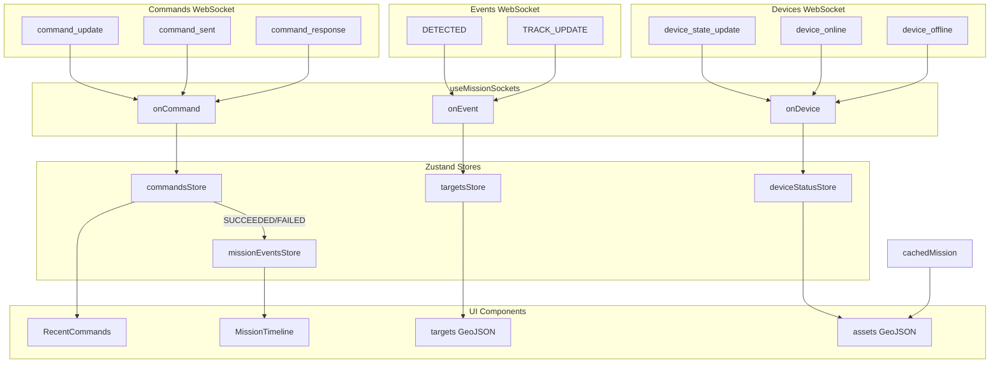

# WebSocket Real-Time Enhancements — Analysis and Possibilities

## Data Structure Analysis

### 1. Events WebSocket (`mission_event`)

| Field                                 | Purpose                                   | Current Use                                                           |
| ------------------------------------- | ----------------------------------------- | --------------------------------------------------------------------- |
| `event_type`                          | Event kind (DETECTED, TRACK_UPDATE, etc.) | Only `DETECTED` handled                                               |
| `payload.target_uid`                  | Unique track ID                           | Used as target `id`                                                   |
| `payload.target_name`                 | Human-readable (e.g. "DJI Phantom 4")     | Not used                                                              |
| `payload.lat`, `payload.lon`          | Position                                  | DETECTED uses `uav_lat`/`uav_lon`; TRACK_UPDATE uses flat `lat`/`lon` |
| `payload.speed_mps`                   | Speed in m/s                              | Mapped to `speedKmH`                                                  |
| `payload.heading_deg` / `azimuth_deg` | Bearing                                   | Used for icon rotation                                                |
| `payload.distance_m`                  | Distance from sensor                      | Used for `distanceKm`                                                 |
| `payload.confidence`                  | Detection confidence (0–100)              | Not used                                                              |
| `payload.source`                      | Data source (e.g. "sim-tracks")           | Not used                                                              |

**Gap:** `TRACK_UPDATE` is **not handled**. The code only processes `DETECTED`, which has a nested `payload.uav` structure. Your sample shows `TRACK_UPDATE` with a **flat** payload (`lat`, `lon`, `target_uid`, etc.) — a different schema.

---

### 2. Devices WebSocket (`device_state_update`)

| Field               | Purpose               | Current Use                          |
| ------------------- | --------------------- | ------------------------------------ |
| `device_id`         | UUID of device        | Matches `cachedMission.devices[].id` |
| `monitor_device_id` | Backend numeric ID    | Stored for reference                 |
| `status`            | ONLINE, OFFLINE, etc. | Merged into assets → ACTIVE/INACTIVE |
| `last_seen`         | ISO timestamp         | Stored in `deviceStatusStore`        |
| `op_status`         | Operational state     | Stored but not surfaced in UI        |

**Status:** Device status updates are **already wired**. `useMissionSockets` → `setDeviceStatus` → `deviceStatusStore.byDeviceId` → `assetsForIntercept` in [MapContainer.tsx](src/components/map/MapContainer.tsx) (lines 176–204). Coverage circles and radar sweeps use `status` (ACTIVE/INACTIVE).

---

### 3. Commands WebSocket

**Status:** Partially wired. `useMissionSockets` handles `command_update`, `command_sent`, etc. → `commandsStore`. Engage flow and command UI need alignment with [GUI-developer guide for implementing commands.pdf](GUI-developer%20guide%20for%20implementing%20commands.pdf).

**Flow per document:**

1. GUI sends `POST /api/v1/commands` → gets `id`, `packet_no`, `status`
2. WebSocket streams: `command_requested` → `command_sent` → `command_response` / `command_failed` / `command_timeout`
3. Status progression: PENDING_APPROVAL → SENDING → SENT → SUCCEEDED / FAILED / TIMEOUT

**Commands to implement (7–12; exclude 1–6 and ALARM_HISTORY):**

| #   | Command           | Datatype | Payload                                        | UI                                    |
| --- | ----------------- | -------- | ---------------------------------------------- | ------------------------------------- |
| 7   | ATTACK_MODE_SET   | 100      | `{ mode: 0                                     | 1, switch: 0                          |
| 8   | ATTACK_MODE_QUERY | 102      | `{}`                                           | Device status badges (Jam: ON / Idle) |
| 9   | BAND_RANGE_SET    | 96       | Array of 12 band objects                       | Spectrum editor                       |
| 10  | BAND_RANGE_QUERY  | 98       | `{}`                                           | Read band config                      |
| 11  | TURNTABLE_DIR     | 142      | `{ direction: 0–8, speed: 63 }`                | D-pad + speed slider                  |
| 12  | TURNTABLE_POINT   | 144      | `{ h_enable, horizontal, v_enable, vertical }` | Azimuth/elevation inputs              |

---

## Real-Time Enhancement Possibilities

### Events WebSocket — Targets/Tracks

| Enhancement                   | Description                                                                     | Defense/Enterprise Value                                               |
| ----------------------------- | ------------------------------------------------------------------------------- | ---------------------------------------------------------------------- |
| **1. TRACK_UPDATE handler**   | Parse `TRACK_UPDATE` and call `addOrUpdateTarget` with position, heading, speed | **Critical** — live drone movement on map instead of static dots       |
| **2. Target name in popup**   | Use `target_name` ("DJI Phantom 4") in hover/click popup                        | Better identification for operators                                    |
| **3. Confidence indicator**   | Low confidence → dimmed icon, badge, or different style                         | Reduces false-alarm clutter; operators focus on high-confidence tracks |
| **4. Track trail / history**  | Store last N positions per target; render as LineString                         | Shows flight path, approach vector, loiter patterns                    |
| **5. Staleness / age**        | If no TRACK_UPDATE for X seconds, show "stale" (greyed, pulsing)                | Highlights lost tracks or sensor dropouts                              |
| **6. TRACK_LOST handler**     | If backend sends track-end event, remove or mark target as lost                 | Clean map; avoids ghost tracks                                         |
| **7. Smooth interpolation**   | Interpolate between TRACK_UPDATEs using speed/heading                           | Smoother motion; less jumpy updates                                    |
| **8. Velocity vector**        | Short line or arrow showing direction and speed                                 | Quick visual assessment of threat vector                               |
| **9. Source badge**           | Show `source` (e.g. "sim-tracks", "radar") in popup                             | Distinguishes live vs simulated; multi-sensor fusion context           |
| **10. Altitude (if present)** | Use `alt_asl_m` / `alt_agl_m` when available                                    | 3D situational awareness                                               |

### Devices WebSocket — Sensors/Towers

| Enhancement                        | Description                                                 | Defense/Enterprise Value                |
| ---------------------------------- | ----------------------------------------------------------- | --------------------------------------- |
| **11. Device status already live** | ACTIVE/INACTIVE from WS → coverage color, sweep speed       | Already implemented                     |
| **12. Last-seen in UI**            | Show `last_seen` in asset popup or panel                    | Operators know sensor freshness         |
| **13. New device discovery**       | If WS sends `device_added` with coords, add to map          | Dynamic sensor deployment; mobile units |
| **14. Op-status indicator**        | Use `op_status` (e.g. WORKING, IDLE) for finer status       | Differentiate scanning vs idle          |
| **15. Device health badge**        | Visual indicator (green/amber/red) based on `last_seen` age | Quick health overview                   |

### Cross-Cutting

| Enhancement                   | Description                                         | Defense/Enterprise Value                                         |
| ----------------------------- | --------------------------------------------------- | ---------------------------------------------------------------- |
| **16. Connection status**     | Show WS status (events/devices) in header           | Operators know if data is live or stale                          |
| **17. Event timeline**        | Add TRACK_UPDATE (or summary) to MissionTimeline    | Audit trail; post-mission review                                 |
| **18. Throttling / batching** | Batch rapid TRACK_UPDATEs to avoid React re-renders | Performance; aligns with "no live telemetry in React state" rule |

### Tracking Panel — Drone Cards with Classification Colors

| Enhancement                          | Description                                                                                 | Defense/Enterprise Value                                                        |
| ------------------------------------ | ------------------------------------------------------------------------------------------- | ------------------------------------------------------------------------------- |
| **19. Drone cards panel**            | Vertical list of drone cards (e.g. Drone-001, Drone-002) with quadcopter icon               | At-a-glance list of all tracked targets; scrollable when many drones            |
| **20. Card color by classification** | Border and summary tags (distance, altitude) colored by classification:                     | **Critical** — instant visual identification of threat level                    |
|                                      | • **Red** — ENEMY / hostile                                                                 |                                                                                 |
|                                      | • **Green** — FRIENDLY / safe                                                               |                                                                                 |
|                                      | • **Neutral / amber** — UNKNOWN                                                             |                                                                                 |
| **21. Card telemetry**               | Per-card: distance (KM), altitude (FT), serial, bandwidth, frequency, RSSI, azimuth, RC/GCS | Full telemetry for operators; driven by WebSocket `TRACK_UPDATE` and `DETECTED` |
| **22. Status tag (e.g. INBOUND)**    | Alert badge on card or panel header when target is inbound or high-threat                   | Real-time alerting; can derive from distance, speed, or event type              |

**Data mapping for card colors:** Classification comes from `Target.classification` (ENEMY | FRIENDLY | UNKNOWN), which is set by:

- Client-side reclassification (user clicks in popup)
- Optional: `confidence` or `source` from events as hints (e.g. low confidence → amber)
- Optional: `op_status` from devices if it indicates threat level (requires backend contract)

**Reference UI:** Dark tactical style; cards with colored borders; distance/altitude in matching color; detailed telemetry in two-column layout.

**Implementation note:** Extend existing [TrackingPanel](src/components/panels/TrackingPanel.tsx) to add classification-based card styling and full telemetry display.

---

### Commands WebSocket — Full Implementation (per GUI Developer Guide)

| Enhancement                             | Description                                                                                                                                                                  | Files                                                                                                                                                                           |
| --------------------------------------- | ---------------------------------------------------------------------------------------------------------------------------------------------------------------------------- | ------------------------------------------------------------------------------------------------------------------------------------------------------------------------------- |
| **23. Engage flow (ATTACK_MODE_SET)**   | Replace hardcoded Engage with REST `POST /api/v1/commands` + WebSocket status. Payload: `{ mode: 0=Expulsion, 1=ForcedLanding, switch: 1 }`. Map "Engage" → ATTACK_MODE_SET. | [PopupControls.tsx](src/components/commands/PopupControls.tsx), [lib/api/commands.ts](src/lib/api/commands.ts)                                                                  |
| **24. Turntable D-pad UI**              | Visual D-pad (direction 0–8: stop, up, down, left, right, diagonals) + speed slider. TURNTABLE_DIR payload. Show "Moving…" until SUCCEEDED.                                  | New: `TurntableControls.tsx` or extend asset popup                                                                                                                              |
| **25. Turntable point-to-azimuth**      | TURNTABLE_POINT: azimuth + elevation inputs, enable toggles.                                                                                                                 | Same as above                                                                                                                                                                   |
| **26. Band spectrum editor**            | 12-band table: enable, start, end, att per band. BAND_RANGE_SET/QUERY. Validate ranges.                                                                                      | New: `BandRangeEditor.tsx`                                                                                                                                                      |
| **27. ATTACK_MODE_QUERY**               | Query current jam state; show "Jam: ON" / "Idle" badge on device/asset.                                                                                                      | Asset popup, AssetsPanel                                                                                                                                                        |
| **28. RecentCommands enhancement**      | Add: device name, packet_no, created_at, result payload preview. Cap at 50.                                                                                                  | [RecentCommands.tsx](src/components/panels/RecentCommands.tsx), [commandsStore.ts](src/stores/commandsStore.ts)                                                                 |
| **29. MissionTimeline command entries** | On SUCCEEDED/FAILED/TIMEOUT, add timeline entry (e.g. "ATTACK_MODE_SET succeeded").                                                                                          | [MissionTimeline.tsx](src/components/panels/MissionTimeline.tsx), [useMissionSockets.ts](src/hooks/useMissionSockets.ts) — call addMissionEvent when command status is terminal |
| **30. Engage status overlay**           | When Engage clicked: small overlay "Command 17281: Sending…" → "Delivered" → "Jam active".                                                                                   | Map overlay or popup                                                                                                                                                            |

**commandsStore:** Extend `CommandWithStatus` to include `packet_no`, `created_at`, `result_payload` (for preview). Ensure WebSocket handler maps `command_update` nested format.

**Excluded commands (not in scope):** SET_TIME, IP_SET, IP_QUERY, GATEWAY_SET, GATEWAY_QUERY, RESTART, ALARM_HISTORY_QUERY.

---

## Architecture Compliance

Per [Driif-Frontend-System-Rules](.cursor/rules/Driif-Frontend-System-Rules.mdc):

- **Live telemetry in Zustand, not React state** — `addOrUpdateTarget` and `setDeviceStatus` already follow this.
- **Mapbox GeoJSON sources** — `updateTargetLayersData` and `setAssetLayersData` update Mapbox directly from store data.
- **WebSocket updates must not trigger React re-renders** — Zustand selectors and `subscribeToIntercepts` pattern keep map updates outside React render path.

---

## Recommended Implementation Order

**Phase 1 (Events — core):**

1. Add `TRACK_UPDATE` handler in `useMissionSockets` with a `trackUpdatePayloadToTarget()` mapper (flat payload → `Target`).
2. Ensure `addOrUpdateTarget` merges updates (position, heading, speed) for existing targets.

**Phase 2 (Commands — core, per GUI Developer Guide):**

1. **Engage flow:** Wire Engage to `POST /api/v1/commands` with ATTACK_MODE_SET, payload `{ mode, switch }`. Remove hardcoded flow.
2. **commandsStore:** Add `packet_no`, `created_at`, `result_payload` to `CommandWithStatus`. Ensure WebSocket handler supports all message types.
3. **RecentCommands:** Add device name (resolve from mission devices), packet_no, created_at, result payload preview. Cap at 50.
4. **MissionTimeline:** Add command completion entries (SUCCEEDED/FAILED/TIMEOUT) to timeline.

**Phase 3 (Commands — Turntable & Band):**

1. **Turntable UI:** D-pad (direction 0–8) + speed slider. TURNTABLE_DIR payload. Show "Moving…" until SUCCEEDED.
2. **Turntable point:** TURNTABLE_POINT with azimuth/elevation inputs. Place in asset popup or dedicated panel.
3. **Band spectrum:** 12-band table editor. BAND_RANGE_SET/QUERY. Validate start/end ranges.
4. **ATTACK_MODE_QUERY:** Add "Query" button; show Jam: ON / Idle badge on device.

**Phase 4 (Events — polish):**

1. Target name in popup.
2. Confidence-based styling (e.g. opacity or badge).
3. Staleness indicator (no update for N seconds).

**Phase 5 (Tracking Panel — drone cards):**

1. Drone cards panel with scrollable list of targets.
2. Card border and summary tags (distance, altitude) colored by classification (red = ENEMY, green = FRIENDLY, neutral = UNKNOWN).
3. Card telemetry (serial, bandwidth, frequency, RSSI, azimuth, RC/GCS) from WebSocket data.
4. Optional: INBOUND or high-threat status tag.

**Phase 6 (Devices — polish):**

1. Last-seen in asset popup.
2. Op-status / health badge.

**Phase 7 (optional):**

1. Track trail (LineString layer).
2. TRACK_LOST handler (if backend supports it).
3. Smooth interpolation.
4. Engage status overlay (floating "Command delivered" near target).

---

## Data Flow (Current + Proposed)

---

## Open Questions

1. **TRACK_LOST / track-end:** Does the backend send an event when a track is lost? If so, what is the `event_type`?
2. **New devices:** Does the devices WS ever send new devices (with coordinates), or only status updates for devices already in `cachedMission`?
3. **DETECTED vs TRACK_UPDATE:** Is DETECTED the first sighting and TRACK_UPDATE the continuous stream, or can both appear for the same track?
4. **Altitude:** Does TRACK_UPDATE (or DETECTED) include altitude? Your sample did not; if it does, we can add 3D/altitude display.

